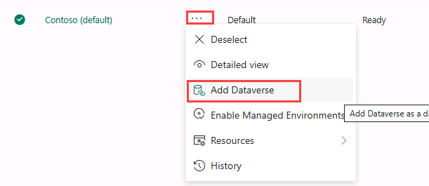
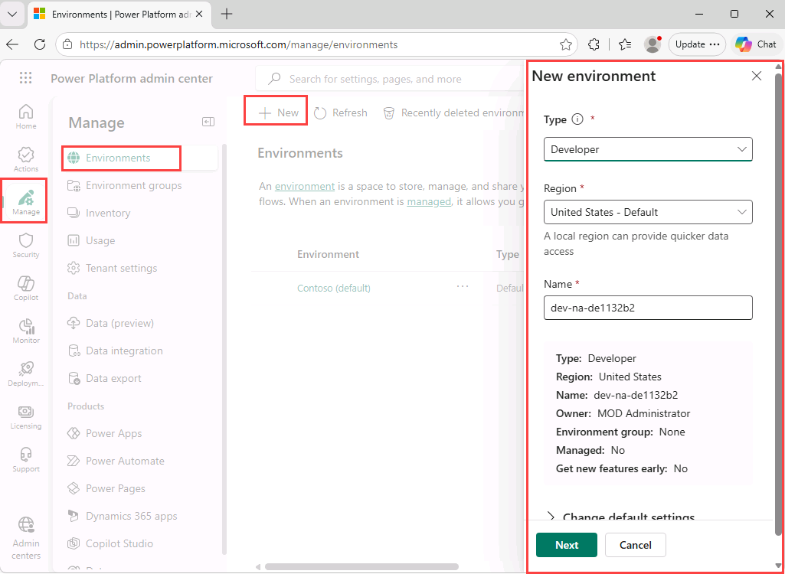
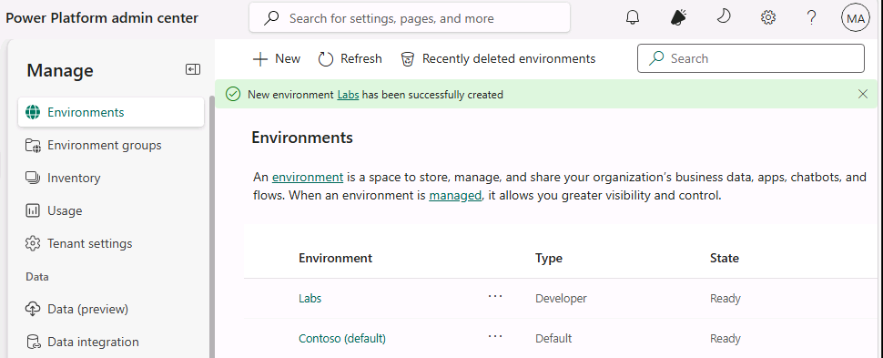
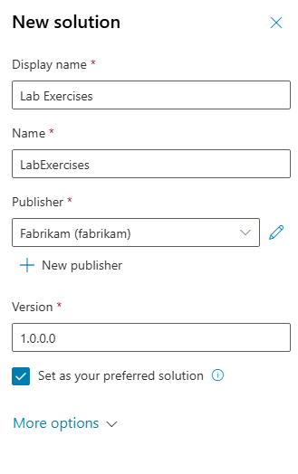

---
lab:
  title: ILT のセットアップ
  module: Introduction
  description: この演習では、Microsoft Copilot Studio ポータルにアクセスし、残りのラボ全体で使用する環境とソリューションを作成します。
  duration: 10 minutes
  level: 200
  islab: true
  primarytopics:
    - Microsoft Copilot
    - Microsoft Copilot Studio
---

## 演習 1 - Power Platform 環境を作成する

### タスク 1.1 - Power Platform 管理センター

ラボの演習を開始する前に、作業用の開発環境を作成する必要があります。

1. Web ブラウザーを開き、`https://admin.powerplatform.microsoft.com/manage/environments` に移動し、この演習の資格情報を使用してサインインします。

1. メッセージが表示されたら、サインインしたままにするオプションを選びます。

1. 表示されているポップアップ メッセージをすべて閉じます。

### タスク 1.2 - Dataverse を既定の環境に追加する

1. **Contoso (既定)** 環境の省略記号 (**...**) を選択し、**[Dataverse の追加]** を選びます。

   

1. 既定の設定をすべてそのままにして、**[追加]** を選択します。

### タスク 1.3 - 新しい環境を作成する

1. **[環境]** ページで、**[+ 新規]** を選択して、次の設定で新しい環境を作成します。

   - **種類**: 開発者
   - **地域**: 既定の地域
   - **名前**: *自分の名前*

   

1. **[デフォルト設定の変更]** を展開し、次の項目を設定します。
   - **環境グループ**: なし
   - **これをマネージド環境にする**: いいえ
   - **新機能を早期に取得する**: いいえ
   - **代理での作成**: いいえ
   - **Dataverse 格納データを追加しますか?**: はい

1. **[次へ]** を選択し、**[Dataverse の追加]** セクションで次のようにします。

   - **言語**: 英語 (米国)
   - **通貨**: USD ($)
   - **サンプル アプリおよびデータの展開**: いいえ

1. **[保存]** を選択し、環境の状態が **[準備完了]** になるまで待ちます (**[更新]** ボタンを使用してディスプレイを更新できます)。

   > [!NOTE]
   > テナントの構成によっては、環境のプロビジョニングに数分かかる場合があります。

   

1. 新しいブラウザー タブで、`https://copilotstudio.microsoft.com/` に移動し、メッセージが表示されたらサインインします。

  > [!NOTE]  
  > 環境への Copilot Studio の読み込みで問題が発生した場合は、次の動作を行います:
  > - まず、Power Platform 管理センターから環境 ID (GUID) をキャプチャします。
  >   1. `https://admin.powerplatform.microsoft.com/manage/environments` で作成した環境を開きます。
  >   2. URL の環境 ID (`12345678-90ab-cdef-1234-567890abcdef` などの長い文字列) を見つけます。
  >   3. この値をコピーして保存します。
  > - その後、ID を次の URL に貼り付けて、環境に直接アクセスしてみてください。
  >   ```
  >   https://copilotstudio.microsoft.com/environments/<your-environment-id>/home
  >   ```

1. メッセージが表示されたら、**[開始する]** を選択し、既定の国または地域の設定はそのままにしておきます。

1. ウェルカム メッセージはスキップします。

1. ページの右上隅で、環境セレクターを使用して環境を切り替え、作成した環境を選択します。

   

### タスク 1.4: ソリューションを作成する

1. 左側のナビゲーション ウィンドウで、省略記号 (**...**) を選択し、**[ソリューション]** を選びます。

1. *[既定のソリューション]* や *[[共通データ モデルの既定のソリューション]* など、いくつかのソリューションが表示されます。

   

1. **+ 新しいソリューション**を選択します。

1. **[表示名]** テキスト ボックスに、「**`Lab Exercises`**」と入力します。

1. **[名前]** が自動的に設定されていることを確認します。

1. **[発行元]** ドロップダウンの下にある **[+ 新しい発行元]** を選択します。

1. **[表示名]** に、`Fabrikam` を入力します

1. **[名前]** に「`fabrikam`」と入力します。

1. **[プレフィックス]** に「`fab`」と入力します。

1. **[保存]** を選択して、発行元を作成します。

1. **[発行元]** ドロップダウンで **[Fabrikam (fabrikam)]** が選択されていることを確認します。

1. **[優先ソリューションとして設定]** チェックボックスをオンにします。

   > [!NOTE]
   > これを優先ソリューションとして設定すると、後のラボで作成された新しい資産が、既定でラボ演習ソリューションに確実に追加されます。

   

1. **［作成］** を選択します

1. **[ソリューション]** ブラウザー タブを閉じます。

1. **Copilot Studio** ページを更新します。

これで、Power Platform 環境とソリューションで作業できるようになりました。
