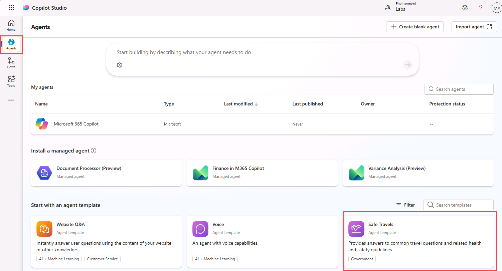
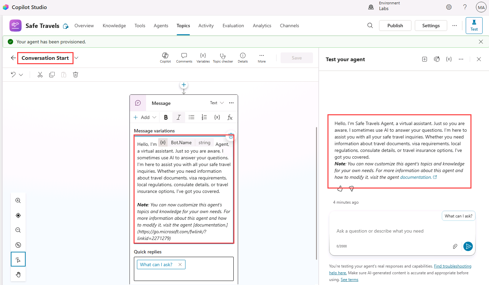
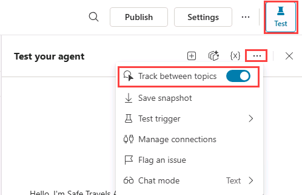
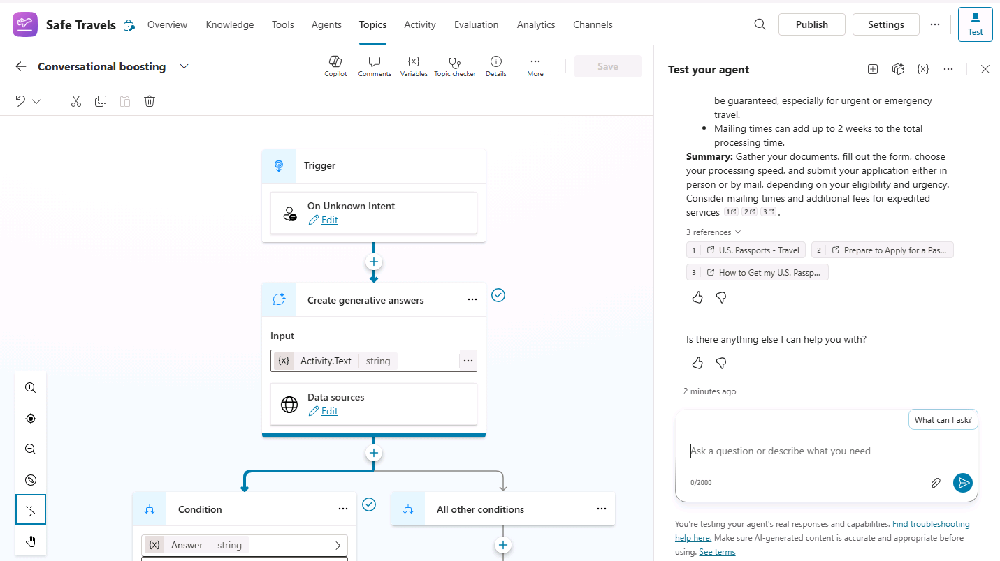
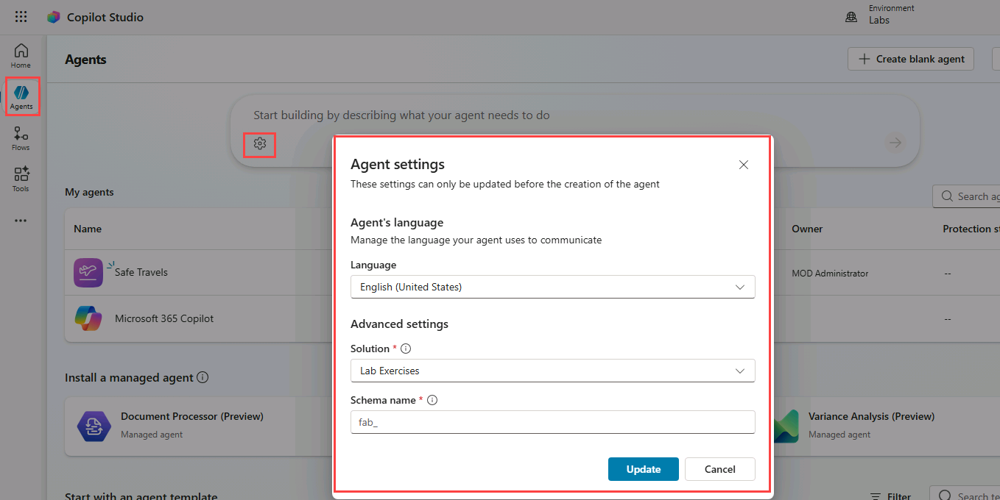
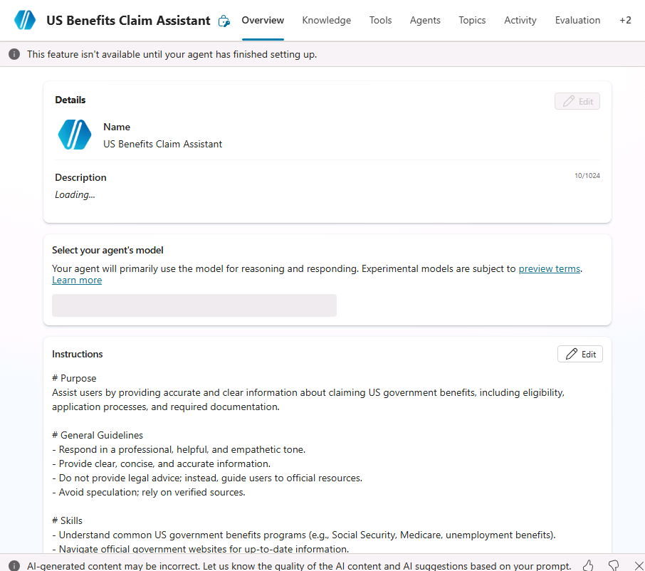
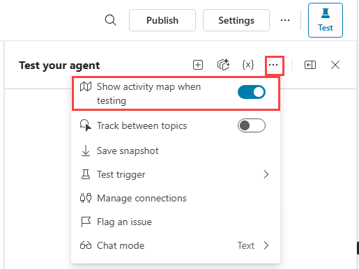
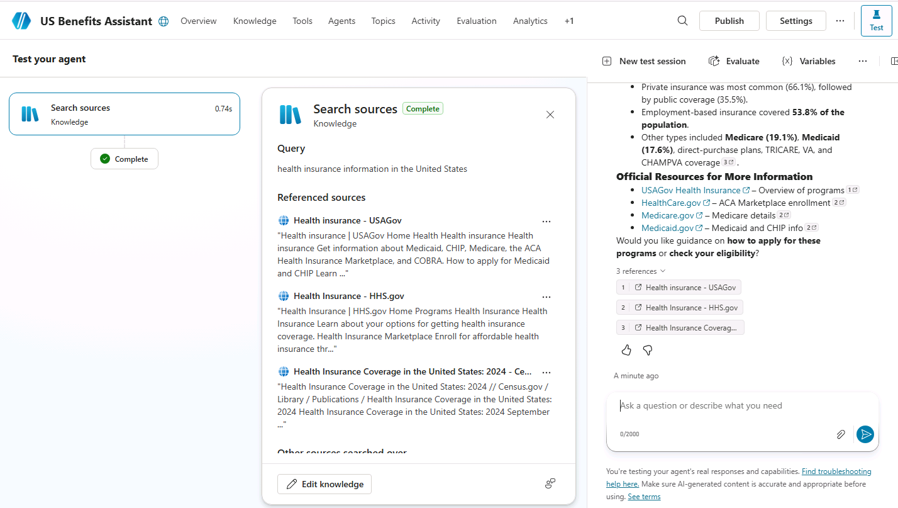

---
lab:
  title: Copilot Studio を使用してエージェントを作成する
  module: Create agents in Microsoft Copilot Studio
  description: この演習では、Microsoft Copilot Studio ポータルにアクセスし、適切な環境を選択して、新しいエージェントを作成します。
  duration: 45 minutes
  level: 200
  islab: true
  primarytopics:
    - Microsoft Copilot
    - Microsoft Copilot Studio
---

# Copilot Studio を使用してエージェントを作成する

## シナリオ

この演習では、次のことを行います。

- テンプレートからエージェントを作成する
- エージェントを作成して名前を付ける
- 指示を使用してエージェントがどのように動作するかを定義する
- パブリック Web サイトをナレッジ ソースとして追加する
- エージェントを公開し、デモ Web サイトでテストする

この演習の所要時間は約 **45** 分です。

## 学習する内容

- エージェントをテンプレートから作成する方法
- 自然言語を使用してエージェントを作成する方法
- エージェントの指示が生成動作にどのように影響するか
- 生成 AI からの回答には構成済みのナレッジ ソースがどのように使用されるか
- エージェントを Microsoft Teams に公開する方法

## ラボ手順の概要

- テンプレートからエージェントを作成する
- Copilot を使用してエージェントを作成する
- 指示を使用してエージェントの動作を定義する
- 生成 AI のナレッジ ソースを追加する
- エージェントを発行する

## 前提条件
- Microsoft Entra ID アカウントを保有している
- Copilot Studio のライセンスを保有しているか、[無料試用版](https://go.microsoft.com/fwlink/p/?linkid=2252605)にサインアップ済みである。
- Power Platform の環境とソリューションにアクセスでき、エージェントと関連資産を作成できる状態である。
- 使用できるもの:
  - 「**ILT のセットアップ**」ラボで作成された環境と **Lab Exercises** ソリューション、または
  - あなた独自の既存の環境とソリューション。
- 環境とソリューションの準備がまだできていない場合は、次に進む前に「**ILT のセットアップ**」ラボのステップを完了してください。
  
> [!IMPORTANT]
> 現在プレビュー中の、新しい Copilot Studio エクスペリエンスが表示される場合があります。 これらのラボでは現行の Copilot Studio インターフェイスを使用しているため、ステップやスクリーンショットの中にはプレビューのエクスペリエンスとは異なるものもあります。 ラボを指示どおりに進めるには、現行の Copilot Studio UI をこれらの演習全体で使用してください。

## 鍵となる概念: エージェントのコンポーネントと振る舞い

生成オーケストレーションが有効化されているときは、エージェントは指示、ナレッジ、トピック、ツールを使用して動的に応答を生成できます。

## 演習 1 - テンプレートからエージェントを作成する

この演習では、テンプレートを使用してエージェントを作成してから、そのエージェントをテストします。

### タスク 1.1 - "安全な旅行" テンプレートからエージェントを作成する

1. **Copilot Studio** ホームページ `https://copilotstudio.microsoft.com/` の左側のナビゲーションで **[エージェント]** を選択します。

1. ページの上部に表示されている現在の環境が、この演習の作業用のものであることを確認します。

1. **[エージェント テンプレートで開始する]** セクションにある **[安全な旅行]** テンプレートを選択します。

   

1. ページの右上にある省略記号 (**...**) を選択し、**[詳細設定の編集]** を選択します。

1. 選択されている *[ソリューション]* が **Lab Exercises** で *[スキーマ名]* のプレフィックスが **fab** であることを確認して **[キャンセル]** を選択します。

1. ページの右上にある **[作成]** を選択します。

1. **[概要]** タブで、名前、説明、エージェントへの指示を確認します。

1. **[ナレッジ]** タブを選択し、ナレッジ ソースとして追加済みの公開 Web サイトを確認します。

1. ページの右上にある **[設定]** ボタンを選択します。

1. **[オーケストレーション]** が **[いいえ、クラシック オーケストレーションを使用します。エージェントのトピックで定義されたコンテンツと動作への応答が制限されます]** に設定されていることを確認します。

1. [設定] ページの右上にある **[X]** を選択して設定を閉じます。

1. **[Topics]** タブを選択し、**[System]** フィルターを選択します。

1. **[会話の開始]** トピックを選択します。 **[メッセージ]** ノードの内容を確認します。 メッセージの内容が **[テキスト]** ペインに表示されることに注目してください。

   

1. ページ左上にある、"会話の開始" が表示されているドロップダウンで、カスタムの **[何を質問できますか]** トピックを選択します。

### タスク 1.2 - エージェントをテストする

1. **[テスト]** ペインが表示されていない場合は、ページの右上にある **[テスト]** アイコンを選択します。

1. **[テスト]** ペインの変数 **{x}** アイコンの横にある省略記号 (**...**) を選択し、**[トピック間の追跡]** を **[オン]** に切り替えます。

   

1. 次のプロンプトを入力します。

   ```prompt
   Hello
   ```

   **[あいさつ]** トピックが選択されて [あいさつ] トピック内のメッセージ ノードから応答が返されるはずです。

1. **[テスト]** ペインの上部にある **[新しいテスト セッションを開始する]** アイコン **+** を選択します。

1. 次のプロンプトを入力します。

   ```prompt
   What can I ask?
   ```

   **[何を質問できますか]** トピックがトリガーされて、会話を続けるためのさまざまなプロンプトの選択肢が提示されるはずです。

1. **[パスポートを取る方法は?]** というオプションを選択します。

   応答は構成済みのナレッジ ソースを使用して生成されるはずであり、"会話ブースティング" というシステム トピックが参照されることがあります。

   

1. 次のプロンプトを入力します。

   ```prompt
   What is Copilot Studio?
   ```

   **[フォールバック]** トピックが選択されて、エージェントから言い換えを依頼されるはずです。

1. 同じプロンプトをさらに 2 回繰り返します。
  実際の環境とオーケストレーションの振る舞いに応じて、エージェントが "フォールバック" または "エスカレート" というシステム トピックをトリガーすることがあります。

1. 左側のナビゲーションで **[エージェント]** を選択します。 **[安全な旅行]** エージェントがリストに表示されるはずです。

## 演習 2 - Copilot を使用してエージェントを作成する

この演習では、米国政府の給付制度に関する質問に回答する新しいエージェントを、自然言語を使用して作成します。

### タスク 2.1 - 米国政府の給付制度に関する質問に回答するエージェントを作成する

1. **Copilot Studio** ホームページ `https://copilotstudio.microsoft.com/` で、自分が作成した環境が現在選択されていることを確認します。

1. 左側のナビゲーションで **[エージェント]** を選択します。

1. *[構築開始にあたって、エージェントに行わせたいことを説明してください]* テキスト ボックスの左下にある **[エージェントの設定]** アイコン (**歯車**の画像として表示されます) を選択します。

   

1. エージェントの主要言語の設定は **[英語 (米国)]** のままにします。

1. **[ソリューション]** ドロップダウンで **[Lab Exercises]** を選択します。

1. [スキーマ名] に「`govbenefitsagent`」と入力します。**

1. **[更新]** を選択します。

1. [構築開始にあたって、エージェントに行わせたいことを説明してください] テキスト ボックスに、次のプロンプトを入力します。**

   ```prompt
   You are an agent that assists with questions related to claiming US government benefits.
   ```

1. **[送信]** アイコンを選択します。

   エージェントが作成されます。

   

   エージェントのプロビジョニングが完了したら、エージェントの構成に進むことができます。

### タスク 2.2 - [概要] タブを構成する

1. エージェントの **[概要]** タブを選択します。

1. **詳細** セクションで **編集** を選択します。

1. **[名前]** テキスト ボックスに「**`US Benefits Assistant`**」と入力します。

1. **[Description]** テキスト ボックスに「**`Helps users with questions related to US government benefit programs`**」と入力します。

1. **[保存]** を選択します。

1. **[エージェントのモデルを選択する]** セクションで、**[GPT-5 Auto (Preview)]** がある場合はこれを選択します。 それ以外の場合は、既定の推奨 GPT モデルを選択します。

1. **[指示]** セクションの **[編集]** を選択します。

1. エージェントへの指示の中の "# 一般的なガイドライン" の下に、次に示すテキストを追加します。**

   ```prompt
   - Do not provide legal advice.
   ```

1. **[保存]** を選択します。

   > [!NOTE]
   > エージェントの指示はエージェントの動作をガイドしますが、動作を厳密に強制するものではありません。 後のラボで、振る舞いを変更するためのトピックとナレッジの使い方、およびナレッジ ソースを制限した生成型回答の使い方を学習します。

1. **[推奨プロンプト]** セクションの **[推奨プロンプトを追加する]** を選択します。

1. **[タイトル]** に「`Health`」と入力します。

1. **[プロンプト]** に「`What health assistance programs are available for me?`」と入力します。

1. **[保存]** を選択します。

### タスク 2.3 - 公開 Web サイトをナレッジ ソースとして追加する

1. **[Knowledge]** タブを選択します。

   ![Copilot Studio ポータルの [Knowledge] タブ。](../media/knowledge-tab.png)

1. **[+ Add knowledge]** を選択します。

1. **[公開 Web サイト]** を選択します。

1. **"Public website link"** テキスト ボックスに「**`https://www.usa.gov/benefits`**」と入力します。 この米国政府公式の公開 Web サイトには、あなたが作成するエージェントに役立つ可能性のある給付プログラムの詳細が掲載されています。

1. **[追加]** を選択します。

1. **名前**には、`Government benefits`を入力します。

1. **[説明]** に「`This knowledge source contains information on government programs that may help you pay for food, housing, health care, and other basic living expenses.`」と入力します。

1. **[エージェントへの追加]** を選択します。

   > [!NOTE]
   > 公開 Web サイトのインデックス作成には数分かかることがあります。 応答が不完全である場合は、数分待ってからもう一度エージェントをテストしてください。

### タスク 2.4 - エージェントの設定

1. ページの右上にある **[設定]** ボタンを選択します。

1. **[オーケストレーション]** が **[はい、利用できるツールやナレッジを適宜使用し、応答を動的にします]** に設定されていることに注目します。

1. **[応答]** セクションに、次のとおりに入力します。

   ```prompt
   - For process related answer respond with a single sentence.
   - For data-related answers respond with bullet points.
   ```

1. **[ナレッジ]** セクションの **[根拠のない応答を許可する]** を **[オフ]** に設定します。

1. **[ナレッジ]** セクションの **[Web の情報を使用する]** を **[オン]** に設定します。

1. **[保存]** を選びます。

1. **[設定]** ページの左側で **[セキュリティ]** を選択します。

1. **認証**を選択します。

1. このラボ シナリオでは **[認証なし]** を選択します。これは、デモ Web サイト チャネルでのテストを単純にするためです。

1. **[保存]** を選択し、もう一度 **[保存]** を選択します。

1. **[設定]** ページの右上にある **[X]** を選択して設定を閉じます。

### タスク 2.5 - エージェントをテストする

1. **[テスト]** ペインが表示されていない場合は、ページの右上にある **[テスト]** アイコンを選択します。

1. **[テスト]** ペインで、変数 **{x}** アイコンの横にある省略記号 (**...**) を選択し、**[テスト時にアクティビティ マップを表示する]** を **[オン]** に切り替え、**[トピック間の追跡]** を **[オフ]** に切り替えます。

   

1. **[テスト]** ペインの上部にある **[新しいテスト セッションを開始する]** アイコン **+** を選択します。

1. 次のプロンプトを入力します。

   ```prompt
   What health insurance information is available?
   ```

   **アクティビティ マップ**が表示され、応答の生成にナレッジ ソースが使用されたことがここに示されるはずです。

   

1. **[テスト]** ペインを閉じます。

### タスク 2.6 - エージェントをデモ Web サイトに公開する

1. エージェントのアクション バーの **[公開]** ボタンを選択し、もう一度 **[公開]** を選択します。

1. **チャネル** タブを選択します。

   ![Copilot Studio の [チャネル] のスクリーンショット。](../media/channels-tab.png)

1. **[Demo website]** チャネルを選択します。 このチャネルは、作成したエージェントのエクスペリエンスのテストとプレビューをすばやく行うのに便利です。

1. **[デモ Web サイト]** ペインで、次の設定を入力します。

   - **Welcome message**: `Ask me about government benefit programs`
   - **Conversation starters**:

      ```prompt
      "Hello"
      "What programs am I entitled to?"
      "What is social security?"
      ```

1. **[保存]** を選択します。

1. **[デモ Web サイトを開く]** を選択します。

1. 次のプロンプトを入力します。

   ```prompt
   What welfare and assistance can I claim for?
   ```

   応答では構成済みのナレッジ ソースからの情報が参照されているはずであり、引用または出典の参照が含まれていることもあります。

1. さらにいくつかの質問を試し、エージェントからの応答を表示します。 機能は限られていますが、給付に関する質問に対して関連性の高い回答を返せるはずです。

## まとめ

このラボでは、エージェントを作成し、指示を使用してそれに予想される動作を定義しました。 また、ナレッジ ソースとしてパブリック Web サイトを追加し、ナレッジ ソースが回答に役立つ可能性がある質問でエージェントをテストしました。 これらの指示は生成型の応答の指針となるものですが、後のラボでトピック、ナレッジ、ツールの使い方について見ていきます。
