---
lab:
  title: Copilot Studio を使用してエージェントを作成する
  module: Build an initial agent with Microsoft Copilot Studio
  description: この演習では、Copilot Studio を使用して、架空の企業の経費ポリシーに関する従業員の質問に回答する簡易エージェントを作成します。
  duration: 10 minutes
  level: 100
  islab: true
---

# Copilot Studio を使用してエージェントを作成する

この演習では、Copilot Studio を使用して、架空の企業の経費ポリシーに関する従業員の質問に回答する簡易エージェントを作成します。

この演習の所要時間は約 **30** 分です。

> **注**: この演習では、既に Copilot Studio ライセンスを所有しているか、[無料試用版](https://go.microsoft.com/fwlink/p/?linkid=2252605)にサインアップしていることを前提としています。

## エージェントを作成する

まず、Copilot Studio を使用して新しいエージェントを作成しましょう。 エージェントの機能は最初は非常に限られていますが、この演習で後ほど拡張します。

1. Web ブラウザーで、**Copilot Studio** (`https://copilotstudio.microsoft.com/`) に移動し、ダイアログが表示されたらサインインします。 ウェルカム メッセージはスキップします。

1. エージェントが定義されている Power Apps **環境**がページの上部に表示されます。 環境を自分で作成したものに変更します。 
    > **注:**  これらのラボ中に上部のナビゲーション バーが完全に読み込まれず、環境名が表示されない場合は、常にブラウザーを更新する (Fn + F5) 必要があります。

1. Copilot Studio ホーム ページを表示します。これは次のような外観をしています。

    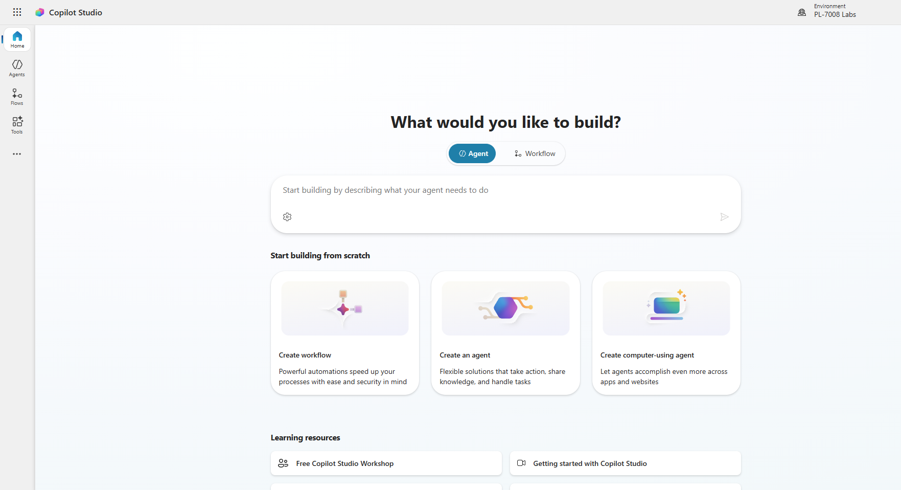

    ホーム ページで、エージェントの作成を開始できます。

1. **[エージェントが実行する必要がある操作を説明して構築を開始する]** に、次のプロンプトを入力します。

    ```prompt
    Create an agent to help employees with expense claims.
    ```

1. **[送信]** アイコンを選択します

    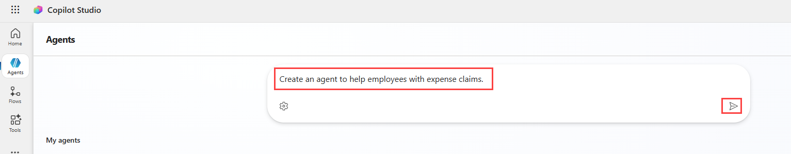

1. Copilot Studio によって作成されたエージェントをレビューします。 エージェントの説明と指示が設定されていることを確認してください。 次のようになります。 

    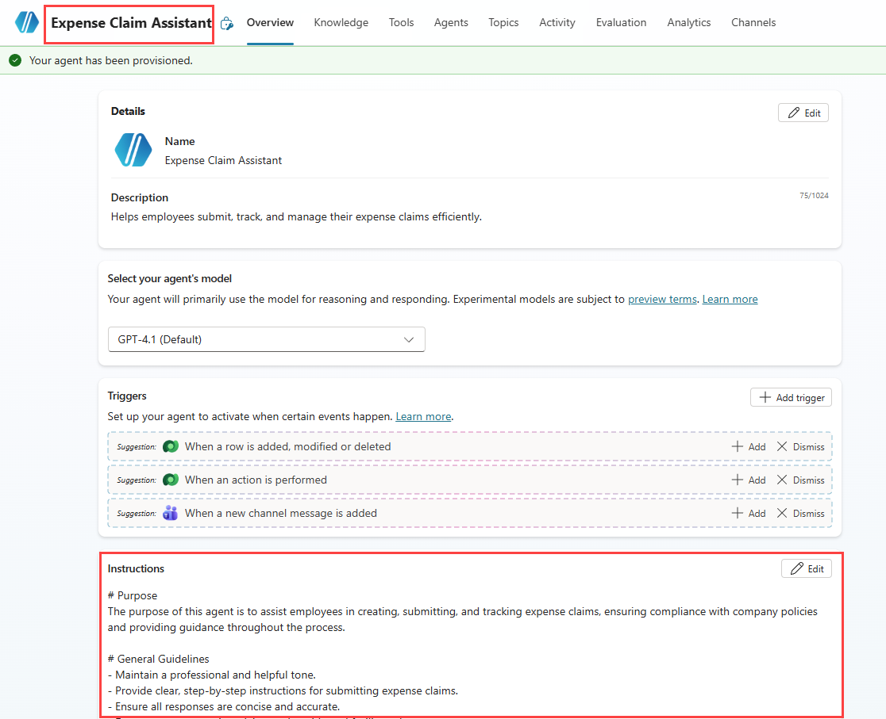

1. **[手順]** セクションの **[編集]** アイコンを選択します。

1. エージェントが `Maintains a friendly and professional tone` ように、**[手順]** を変更します。

1. `Avoid providing any tax advice.` を **[手順]** に追加します。

1. **[保存]** を選択します。

    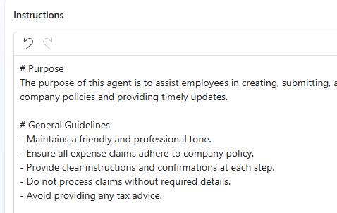

1. **[ナレッジ]** セクションまで下スクロールし、**[すべてのパブリック Web サイトが検索されるようにエージェントを有効にする]** を **[無効]** に切り替えます。

    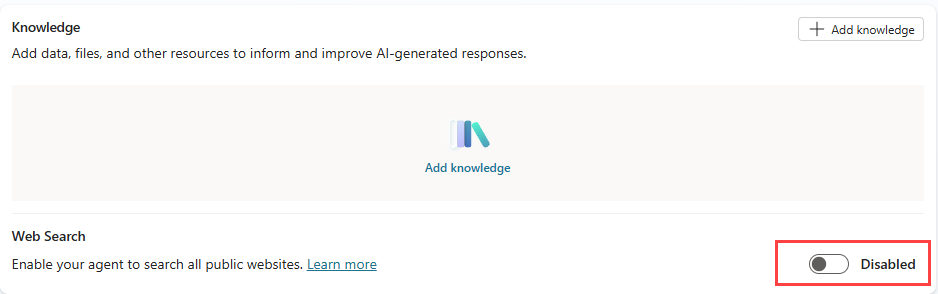

1. **[Test your agent]** ペインで、次のプロンプトを入力します。

    ```prompt
    Hello
    ```

    その応答を確認します。適切なあいさつメッセージになっているはずです。

1. 次に、次のプロンプトを試してください。

    ```prompt
    Who should I contact about submitting an expense claim?
    ```

    今度は、応答が適切な可能性もありますが、かなり汎用的である可能性もあります。 実際の組織では、ユーザーが連絡を取るためのメール アドレスまたは電話番号をエージェントが指定する必要があります。

1. 別のプロンプトを試してみましょう。

    ```prompt
    What's the expense limit for a hotel stay?
    ```

    ここでも、応答は適切ではあるものの汎用的である可能性があります。 実際の組織では、エージェントが会社の経費ポリシーに基づいてより具体的な応答を提供する必要があります。

1. **[Test your agent]** ペインを閉じます。

## エージェントで*トピック*を管理する

*トピック*を使用すると、ユーザーが入力すると予想されるよくある質問や要求など、*トリガー*への明示的な応答を提供できます。

1. エージェントのページで、**[Topics]** タブを選択してトピックを表示します。

    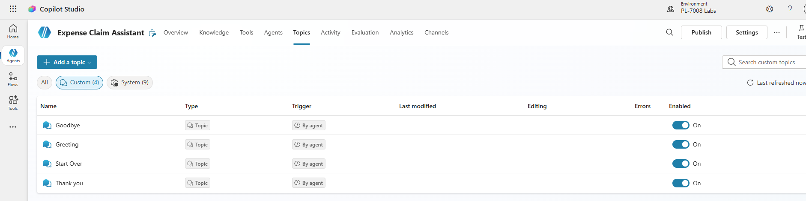

    エージェントには、ユーザーからの入力によってトリガーされる***カスタム*** トピックと、エラーや予期しない入力など、特定のイベントによってトリガーされる追加の***システム*** トピックがいくつかあります。 トピックをカテゴリ別にフィルター処理するか、**[All]** フィルターを使用してすべてを表示できます。

1. **[Greeting]** カスタム トピックを選択して、*作成キャンバス*に表示します。これは、トピックを作成および編集するためのビジュアル デザイナーであり、次のようになります。

    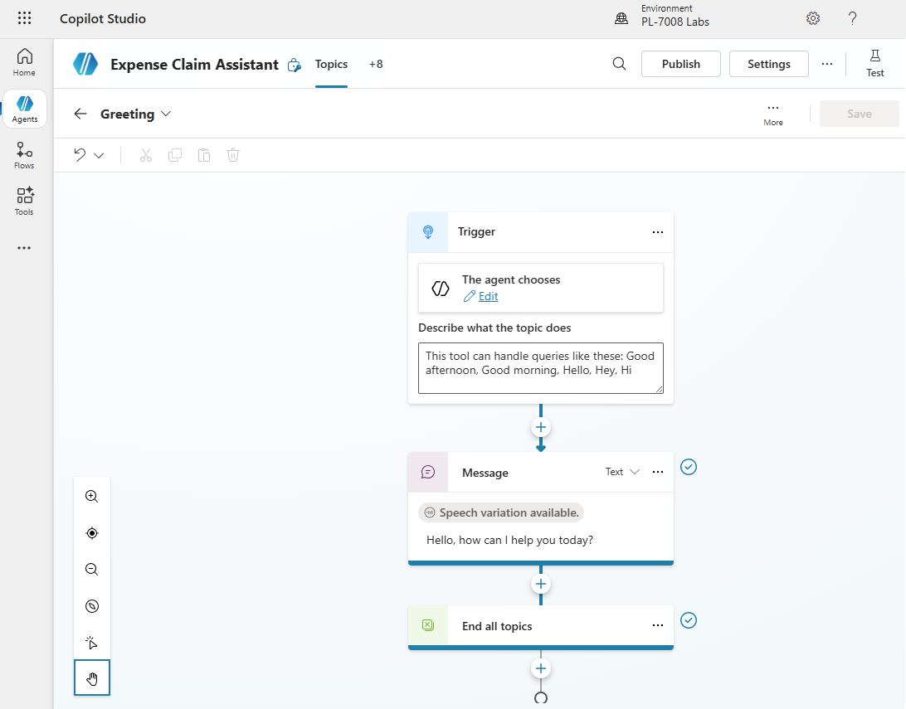

    *[Greeting]* トピックは、次のいずれかの語句が存在する入力によってトリガーされます。

    - *Good afternoon*
    - *おはようございます*
    - *Hello*
    - *Hey* \(やあ\)
    - *Hi*

    このトリガーへの応答は、ユーザーに「*Hello. How can I help you today?*」というメッセージを返すことです。 エージェントにこのトピックを含めると、テスト時に以前確認した応答について説明します。

1. **[Topics]** ページに戻り、**[System]** トピックを表示します。 これらには、会話内の一般的なイベントに関するトピックが含まれることに注意します。 具体的には、次のシステム トピックに注意します。
    - **会話強化**: このトピックは、エージェントが対応するトピックを識別できないメッセージ (ユーザーの *意図* が不明) をユーザーが送信したときにトリガーされます。 次に、このトピックでは、生成 AI を使用してユーザーのメッセージへの応答を試みます。
    - **フォールバック**: このトピックは、意図が不明で、適切な会話型 AI 応答を生成できない場合に応答する "フェールセーフ" トピックです。 フォールバック トピックには、ユーザーが会話を正常に終了する前に最大 3 回再試行できるようにするロジックが含まれています。多くの場合、人間のオペレーターにエスカレートします。
1. **[トピック]** ページに戻り、**[+ トピックの追加]** メニューで、**[トピック]** \> **[Copilot を使用して説明から追加]** を選択します。

1. **[Copilot を使用して説明から追加]** ダイアログ ボックスで、新しいトピックに `Ask about expenses contact` という名前を付け、次のテキストを入力して、トピックの内容を Copilot Studio に伝えます。

    ```prompt
    When the user asks who to contact about expense claims, tell them to send an email to finance@contoso.com
    ```

1. **［作成］** を選択します

1. メッセージが表示されたら、**[クリップボードにコピーされたテキストと画像の表示を****許可]** を選択します。

1. しばらく待つと、*"Ask about expenses contact"* という名前の新しいトピックが作成され、作成キャンバスで開かれます。作成キャンバスでは、次のようになります。

    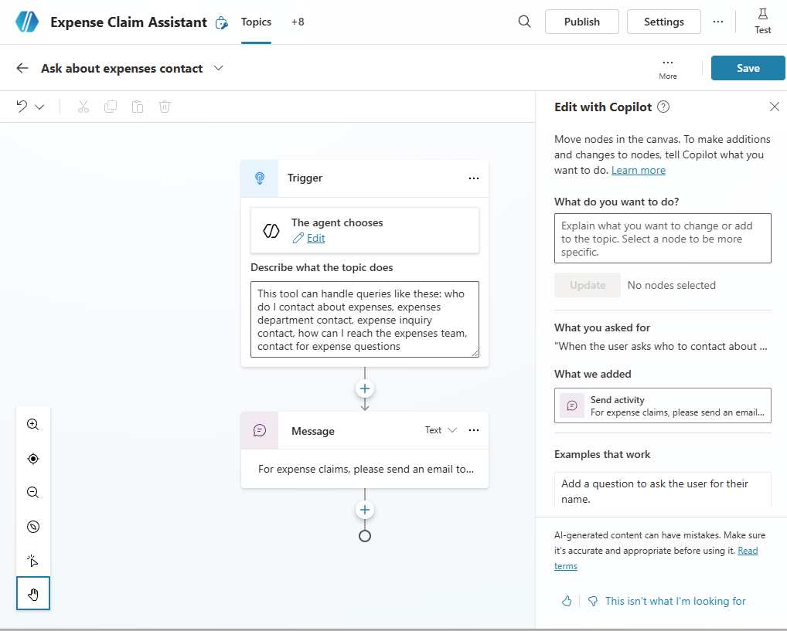

    新しいトピックは、経費に関する連絡先について尋ねるフレーズによってトリガーされ、適切なアドレスに電子メールを送信するようにユーザーに伝えるメッセージで応答する必要があります。

    > **重要**: トピック内のノードが上記の図と異なる場合は、トピックを削除して、トピックをもう一度作成します。

1. **[Save]** ボタン (右上) を使用して、新しいトピックをエージェントに保存します。

1. **[Test]** ウィンドウを開き、次のプロンプトを入力します:

    ```prompt
    Who should I contact about submitting an expense claim?
    ```

    「応答を表示」。応答は、追加したトピックに基づいているはずです (入力したテキストがトリガー内のどのフレーズとも完全に一致していなくても、意味的にはトピックをトリガーするのに十分近いはずです)。

    ![[テスト] ペインのスクリーンショット](media/test-pane.png)

## 生成 AI 応答のナレッジ ソースを追加する

ユーザーが入力すると予想されるすべての入力に対してトピックを追加できますが、現実的には、尋ねられるすべての質問を予測することはできません。 現在、エージェントは*会話強化*トピックを使用して、言語モデルから AI 応答を生成しますが、一般的な回答しか得られません。 より関連性の高い情報を提供するには、生成 AI 応答の*基礎*となるナレッジ ソースを提供する必要があります。

1. 新しいブラウザー タブを開き、`https://github.com/MicrosoftLearning/mslearn-copilotstudio/raw/main/expenses/Expenses_Policy.docx` に移動して、[経費ポリシー ドキュメント](https://raw.githubusercontent.com/MicrosoftLearning/mslearn-copilotstudio/main/expenses/Expenses_Policy.docx)をローカルにダウンロードします。 このドキュメントには、架空の Contoso 企業の経費ポリシーの詳細が含まれています。

1. Copilot Studio のブラウザー タブに戻り、**[エージェントのテスト]** ペインを閉じて、**[ナレッジ]** タブを選択して、エージェントで定義されているナレッジ ソースを表示します (現在は存在しないはずです)。

    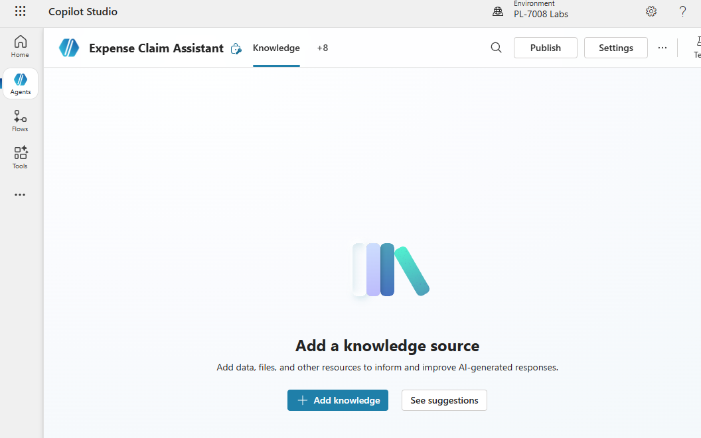

1. **[+ Add knowledge]** を選択し、エージェントに追加できる複数の種類のナレッジ ソースを確認します。

    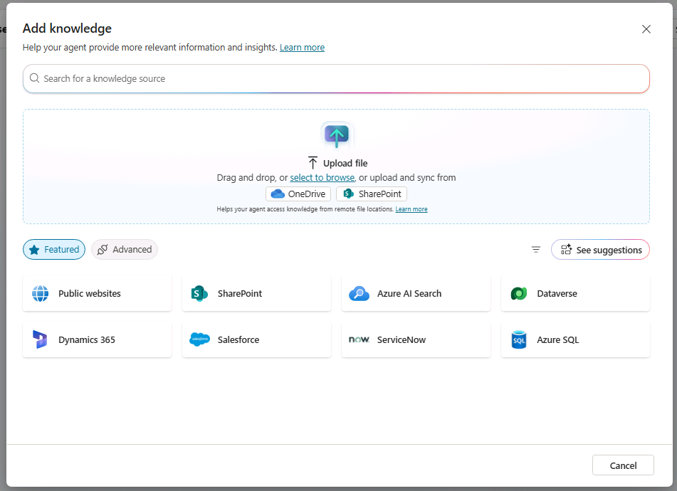

1. **[ファイルをアップロードする]** セクションで、**[選択して参照]** を使用して前にダウンロードした経費ポリシー ドキュメントをアップロードし、**[エージェントへの追加]** を選択します。

    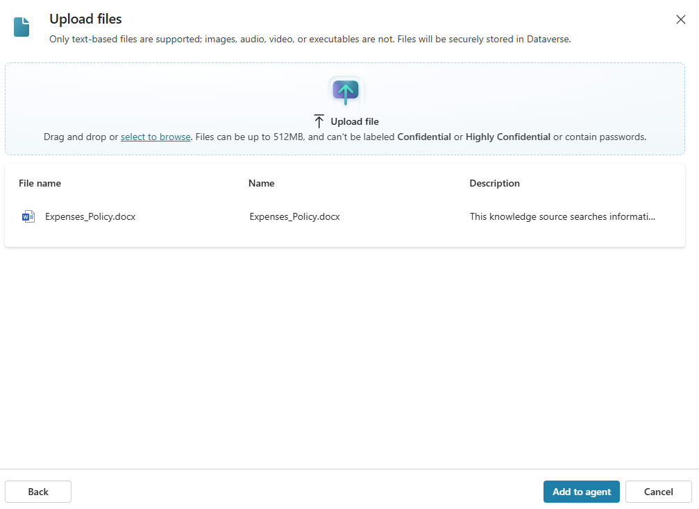

    > **注**:ファイルをアップロードすると、Copilot Studio でファイルのインデックス作成が開始されます。 これには 10 分以上かかる場合があるため、次の演習の後にもう一度確認します。

## エージェントを構成する

1. ページの上部にある **設定** を選択します。

1. **[Security]** ページの **[Settings]** ペインで、**[Authentication]** を選択します。 次に、**[認証なし]** のオプションを選択し、構成に対する変更の **[保存]** を選択して、**[保存]** をもう一度選択します (すべてのユーザーに対してエージェントへのアクセスを有効にすることを確定します)。

1. **[Settings]** ペインを閉じます。

1. **チャネル** タブを選択します。

    ![Copilot Studio の [チャネル] のスクリーンショット。](media/channels-page.png)

1. **[Demo website]** チャネルを選択します。 これは、ユーザーがエージェントをテストするのに適したチャネルです。

1. **[Demo website]** ペインで、次の設定を入力します。
    - **Welcome message**: `Ask me about Expense claims`
    - **Conversation starters**:

        ```prompt
        "Hello"
        "Who should I contact with expense inquiries?"
        "What are the expense limits for flights?"
        ```

1. **[保存]** を選択します。

1. **[デモ Web サイト]** ペインを閉じます。

## ファイルのインデックス作成を確認する

アップロードしたファイルのインデックス作成が完了しているかどうかを見てみましょう。 完了していない場合は、コーヒー休憩を取り、数分ごとに確認してみてください。

1. **[Knowledge]** タブを選択します。

1. ファイルのアップロードの**状態**を確認します。 まだ **[進行中]** の場合は、**[準備完了]** になるまで数分ごとに更新します。

1. ファイルの準備ができたら、**[Topics]** ページを表示し、**[Conversational boosting]** システム トピックを開きます。 このトピックは不明な意図によってトリガーされ、ナレッジを含むデータ ソース (アップロードしたファイルなど) に基づいて生成 AI 応答を作成することを思い出してください。

    > **注**: 追加したカスタム ナレッジ ソースに関連する回答が見つからない場合、トピックでは言語モデルに固有のナレッジを使用して、より一般的な回答を提供する場合があります。 返される生成 AI 応答をより細かく制御する必要がある場合は、検索を特定のナレッジ ストアに制限するようにトピックを構成できます。

## エージェントをテストする

作業エージェントが作成されたので、デモ Web サイトでテストして、ユーザーが使用できる状態であることを確認できます。 デモ Web サイトを表示するには、エージェントを公開する必要があります。 エージェントの公開に必要なライセンスをお持ちでない場合は、この演習をスキップしても構いません。

1. **[Publish]** を選択し、もう一度 **[Publish]** を選択します。

1. **チャネル** タブを選択します。

1. **[Demo website]** チャネルを選択します。

1. **[デモ Web サイトを開く]** を選択します。

1. 次のプロンプトを入力します。

    ```prompt
    What's the expense limit for a hotel stay?
    ```

    応答は、アップロードしたナレッジ ソースの情報に基づき、引用参照を含める必要があります。

1. 次のようなフォローアップ質問をしてみてください。
    - `What about flights?`
    - `What guidelines are there for entertainment expenses?`
    - `What are the expense limits for meals?`

1. さらにいくつかの質問を試し、エージェントからの応答を表示します。 このエージェントは機能が限られていますが、経費請求に関する質問に対する適切な回答を提供できるはずです。

## 課題

これで、Copilot Studio を使用して簡易エージェントを作成する方法がわかりました。次は、習得した知識を自力で適用します。 Microsoft Copilot に関する質問に対する回答を提供するエージェントを作成してみてください。

- 新しいエージェントを作成する
- `https://www.microsoft.com/en-us/microsoft-copilot/` と `https://learn.microsoft.com/en-us/copilot/` の Web サイトをナレッジ ソースとして使用します。

> **ヒント**: サポートが必要な場合は、[Copilot Studio のドキュメント](https://learn.microsoft.com/microsoft-copilot-studio/) (`https://learn.microsoft.com/microsoft-copilot-studio/`) をご覧ください。
