---
lab:
  title: Copilot Studio エージェントでトピックを管理する
  module: Design agent conversations using topics
  description: このラボでは、Copilot を使用して、エージェントの作成、説明からのトピックの作成、ノードの追加、エンティティの使用、変数の管理を行います。
  duration: 45 minutes
  level: 200
  islab: true
  primarytopics:
    - Microsoft Copilot Studio
---

# Copilot Studio エージェントでトピックを管理する

## シナリオ

この演習では、次のことを行います。

- エージェントを作成する
- 既存のトピックを管理する
- Copilot を使用してトピックを作成および編集する
- 変数スコープを構成する
- トピックを手動で作成する
- ノードの作成と編集
- エージェントをテストする

この演習の所要時間は約 **45** 分です。

## 学習する内容

- トピックがどのようにして生成 AI の応答を補完するのか
- どのようなときにトピックを使用して構造化された会話を適用するのか
- どのようにして自然言語を使用してトピックの作成と調整を行うのか
- 変数の使用方法

## ラボ手順の概要

- Copilot を使用してエージェントを作成する
- 不要なトピックを確認および無効化する
- Copilot を使用してトピックを作成する
- 自然言語を使用してトピックの内容を編集する
- トピックの動作をテストする

## 前提条件

- Microsoft Entra ID アカウントを持っている
- Copilot Studio のライセンスを持っているか、[無料試用版](https://go.microsoft.com/fwlink/p/?linkid=2252605)にサインアップしている。
- Power Platform 環境と、エージェントや関連資産を作成できるソリューションにアクセスできる。
- 使用できるもの:
  - 「**ILT のセットアップ**」ラボで作成された環境と **[ラボ演習]** のソリューション、または
  - 独自の既存の環境とソリューション。
- 環境とソリューションをまだ準備していない場合は、続行する前に「**ILT のセットアップ**」ラボの手順を完了してください。
  
> [!IMPORTANT]
> 現在プレビュー段階にある新しい Copilot Studio エクスペリエンスが表示される場合があります。 以下のラボでは現在の Copilot Studio インターフェイスを使用するため、一部の手順やスクリーンショットがプレビュー段階のエクスペリエンスと一致しない可能性があります。 指示に従ってラボを正常に完了するには、以下の演習中は現在の Copilot Studio UI を使用してください。

## 主要な概念: エージェントのコンポーネントと動作

生成オーケストレーションを有効にすると、エージェントは指示、知識、トピック、ツールを使用して応答を動的に生成できます。

トピックは特に、次のことが必要な場合に役立ちます。

- 必要な情報をステップごとに収集する
- 質問の順序を制御する
- 変数に応答を格納する
- 予測可能な結果を維持する

## 演習 1 - エージェントを作成する

この演習では、自然言語を使用して、政府の給付金に関する質問に回答する新しいエージェントを作成します。

### タスク 1.1 – 保険請求を審査するエージェントを作成する

1. **Copilot Studio** のホーム ページ (`https://copilotstudio.microsoft.com/`) で、この演習に使用する環境にいることを確認します。

1. 左側のナビゲーションで、**[エージェント]** を選択します。

1. "構築を開始するにあたって、エージェントに何をしてほしいかを説明してください" テキスト ボックスの左下で、**[エージェントの設定]** アイコンを選択します。これは、**歯車**の画像として表示されます。**

   ![[エージェントの設定] ダイアログのスクリーンショット。](../media/agent-settings-dialog.png)

1. エージェントの主要言語は、**[英語 (米国)]** を設定したままにしておきます。

1. **[ソリューション]** ドロップダウンで、**[ラボ演習]** またはこの演習で使用したい他のソリューションを選択します。

1. [スキーマ名] に「`insuranceagent`」と入力します。**

1. **[更新]** を選択します。

1. "構築を開始するにあたって、エージェントに何をしてほしいかを説明してください" テキスト ボックスに、次のプロンプトを入力します。**

   ```prompt
   You are an agent that assists with reviewing insurance claims including damage assessment details and repair estimates.
   ```

1. **[送信]** アイコンを選択します。

   エージェントがプロビジョニングされたら、エージェントの構成に進むことができます。

## 演習 2 - トピックを管理する

この演習では、エージェントに、引き継ぎ先となる人間の担当者がいないため、[システム トピックをエスカレートする] を無効にします。 使用されないシステム トピックを無効にすると、生成オーケストレーションで応答方法を決定する際のあいまいさを軽減することができます。

### タスク 2.1 - トピックを無効にする

1. **[Topics]** タブを選択します。

1. **[システム]** フィルターを選択します。

1. **[エスカレートする]** トピックを見つけます。

1. **[エスカレートする]** トピックの **[有効]** を **[オフ]** に切り替えます。

   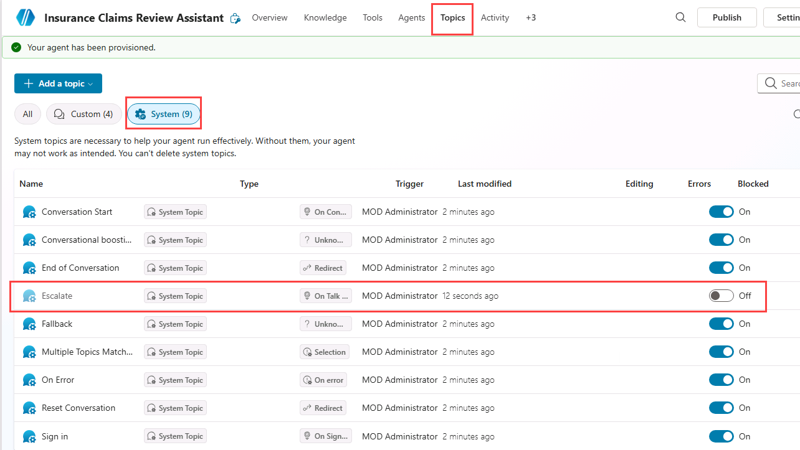

未使用のトピックを無効にすると、複数のトピックまたは生成応答で同じ要求を処理できる場合のあいまいさが軽減されます。

## 演習 3 - 自然言語を使用してトピックを作成する

この演習では、Copilot を使用して説明からトピックを作成します。 これにより、生成 AI が初期構造を下書きして、それを調整することができます。

### タスク 3.1 – 説明からトピックを追加する

1. **[+ トピックの追加]** を選択し、**[Copilot を使用して説明から追加]** を選択します。 新しいダイアログが表示されます。

   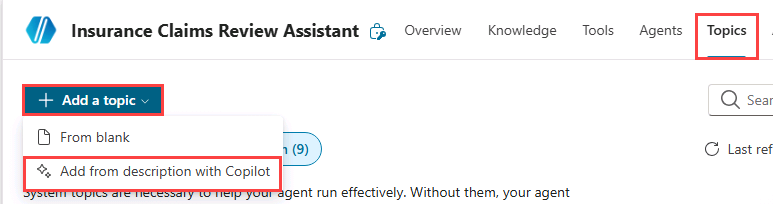

   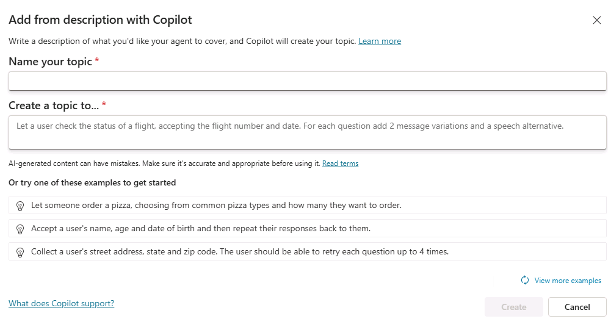

1. **[Name your topic]** テキスト ボックスに「**`Customer Details`**」と入力します。

1. **[トピックを作成する目的]** テキスト ボックスに「**`Ask the customer for their name and email address`**」と入力します。

1. **［作成］** を選択します

1. **[保存]** を選択します。

### タスク 3.2 – 自然言語を使用してノードを編集する

1. **[エージェントのテスト]** パネルが開いている場合は、パネルを閉じます。

1. **[顧客の詳細]** ペインの右側に **[Copilot で編集]** パネルが表示されない場合は、作成キャンバスの上部にある **Copilot** アイコンを選択します。

   ![[Copilot で編集] アイコンのスクリーンショット。](../media/edit-with-copilot.png)

1. 2 番目の **[質問]** ノードである **[What is your email address?]** を選択します。

   ![[Copilot で編集] アイコンのスクリーンショット。](../media/copilot-email-address-node.png)

1. **Copilot で編集**パネルで、**何の操作を実行しますか?** フィールドに、次のテキストを入力します。

   `Change "What is your email address?" to say thank you to the Name variable from the previous node and then proceed to ask the email address question.`

1. **[更新]** を選択します。

   ![プロンプトを含む [Copilot で編集] パネルのスクリーンショット。](../media/edit-with-copilot-panel.png)

   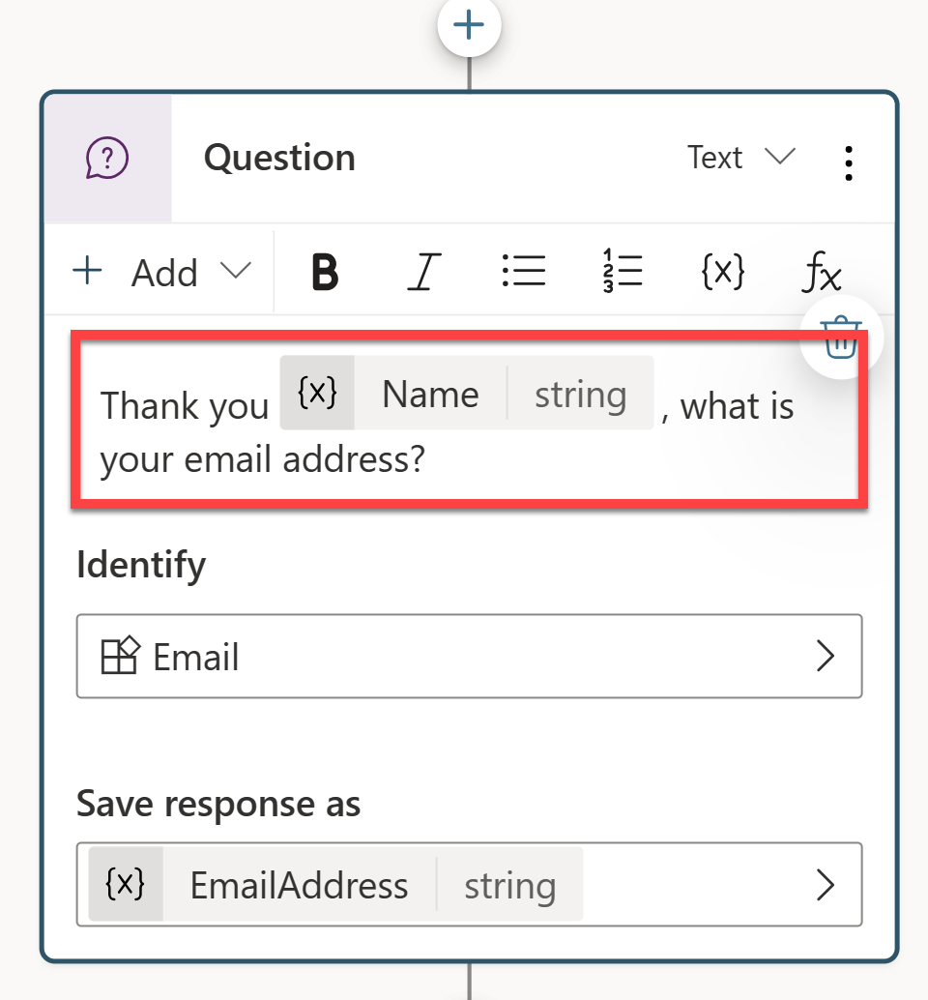

   > [!NOTE]
   > 更新されたメッセージは、前の質問ノードで収集された **Name** 変数を参照し、スクリーンショットのようになります。 **[Copilot で編集]** で質問ノードが正しく更新されなかった場合は、**[元に戻す]** を選択し、別のプロンプトでもう一度試します。

1. **[保存]** を選択します。

### タスク 3.3 – 自然言語を使用してアダプティブ カード ノードを追加する

既存のノードを変更するだけでなく、Copilot を使用して新しいノードを追加することもできます。

1. 作成キャンバスで空の領域を選択すると、ノードは選択されません。

1. **Copilot で編集**パネルで、**何の操作を実行しますか?** フィールドに、次のテキストを入力します。

   `Summarize the information collected in an adaptive card`

1. **[更新]** を選択します。

   トピックの末尾に、アダプティブ カードを含むメッセージ ノードが追加されます。

   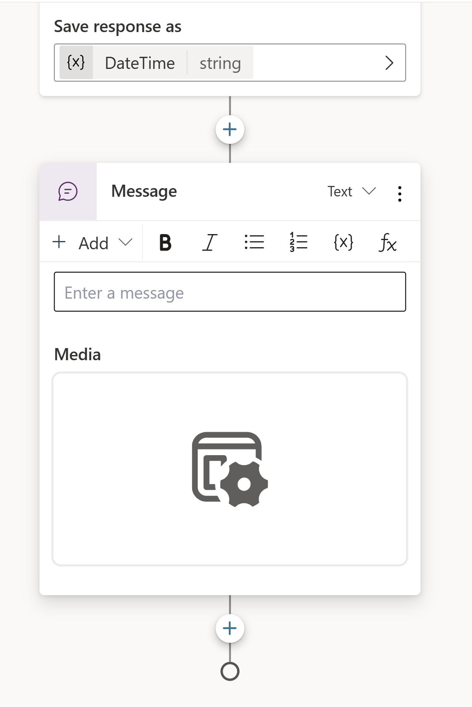

1. アダプティブ カードの **[Media]** ボックスを選択します。 画面の右側にアダプティブ カードのプロパティが表示されます。

   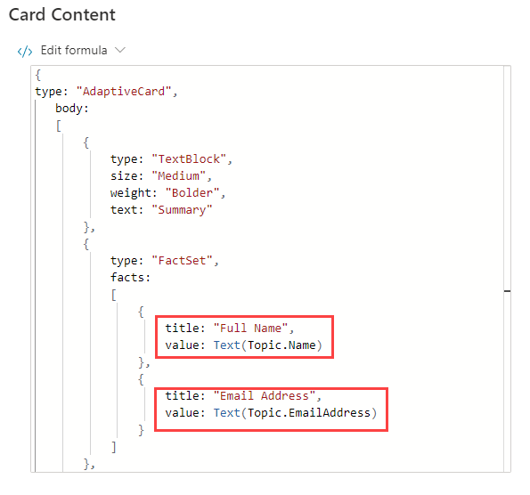

   アダプティブ カードの式は、上記のようになります。 アダプティブ カードが大きく異なる場合は、次の数式に置き換えることができます。

   ```powerfx
   {
   type: "AdaptiveCard", 
       body: 
       [
           {
               type: "TextBlock",
               size: "Medium",
               weight: "Bolder",
               text: "Summary"
           },
           {
               type: "FactSet",
               facts: 
               [
                   {
                       title: "Full Name",
                       value: Text(Topic.Name)
                   },
                   {
                       title: "Email Address",
                       value: Text(Topic.EmailAddress)
                   }
               ]
           },
           {
               type: "TextBlock",
               text: "Thank you for providing the information."
           }
       ]
   }
   ```

### タスク 3.4 – 自然言語を使用して質問ノードを追加する

1. 作成キャンバス内の空白部分を選択して、ノードが選択されていないことを確認します。

1. **Copilot** アイコンを選択して、**[Copilot で編集]** ペインを再度開きます。

1. **何の操作を実行しますか?** フィールドに、次のテキストを入力します。

   `Add a new multiple choice question to prompt the user if the details are correct with two options Yes or No`

1. **[更新]** を選択します。

1. トピックの末尾に、ユーザーが選択できるオプションを含む新しい質問ノードが追加されます。

   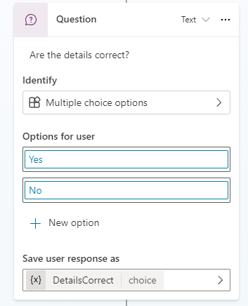

1. **[保存]** を選択します。

## 演習 4 - 変数のスコープ

他のトピックから変数にアクセスできるようにします。

### タスク 4.1 - 変数のスコープを構成する

1. **[Topics]** タブを選択します。

1. **[Customer Details]** トピックを選択します。

1. 上部のバーで **[変数]** を選択して **[変数]** ペインを開きます (**[その他]** \> **[変数]** を選択することが必要な場合があります)。

1. **[トピック]** 変数を選択して展開します。

1. 3 つのトピック変数の右側のチェック ボックスをオンにします。 これにより、変数は、エージェント内の他のトピックで使用できるようになります。

   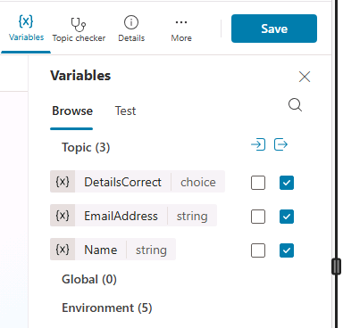

1. **[保存]** を選択します。

## 演習 5 - 空白からトピックを作成する

この演習では、**[修理を見積もる]** トピックを作成し、ノードを追加し、[顧客の詳細] トピックを呼び出します。

### タスク 5.1 - 空白からトピックを作成する

1. **[Topics]** タブを選択します。

1. **[+ Add a topic]** を選択し、**[From blank]** を選択します。

1. **[詳細]** アイコンを選択して **[トピックの詳細]** ペインを開きます (**[その他]** \> **[詳細]** を選択することが必要な場合があります)。

1. **"Name"** フィールドに、次のテキストを入力します。

   `Estimate Repair`

1. **[モデルの説明]** フィールドに、次のテキストを入力します。

   `Use this topic when a repair estimate for an insurance claim must be booked with the customer`

   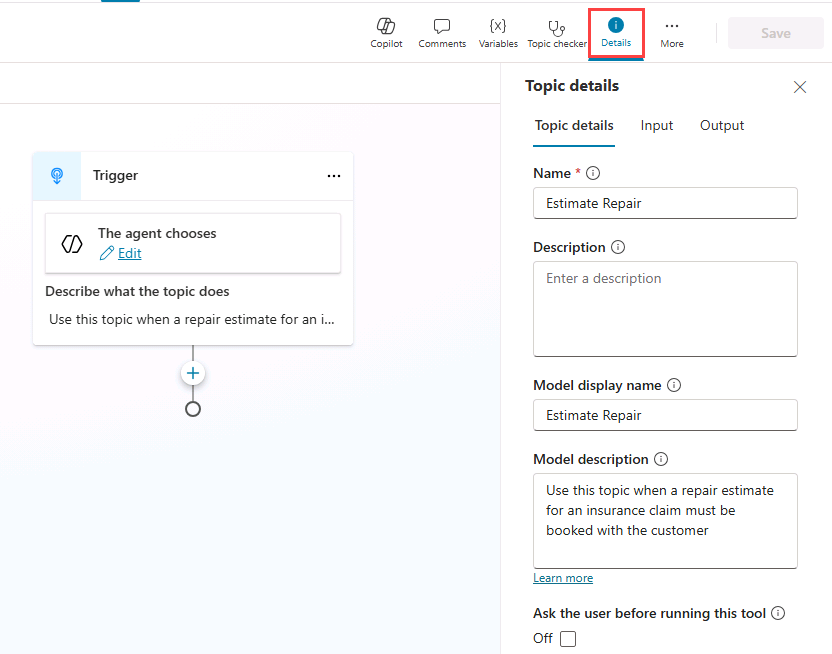

1. **[保存]** を選択します。

### タスク 5.2 - トリガーの種類を確認する

1. トピックの上部にある **[トリガー]** ノードを選択します。 トリガーの種類が **[エージェントで選択]** に設定されていることを確認します。

   > [!NOTE]
   > 生成オーケストレーションを有効にすると、エージェントはこの説明を使用して、トピックを使用する場合を決定します。

### タスク 5.3 - メッセージ ノードを追加する

1. [トリガー] ノードの下にある **[+]** アイコンを選択し、**[メッセージの送信]** を選択します。

   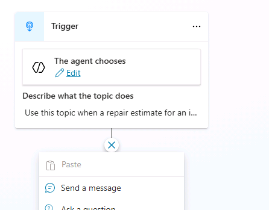

1. **"Enter a message"** フィールドに、次のテキストを入力します。

   `Hi, I can help you with booking a repair estimate.`

1. **[保存]** を選択します。

### タスク 5.4 - [顧客の詳細] トピックにルーティングする

1. **[メッセージ]** ノードの下にある **[+]** アイコンを選択します

1. **[トピック管理]** \> **[別のトピックに移動]** \> **[顧客の詳細]** を選択します。

   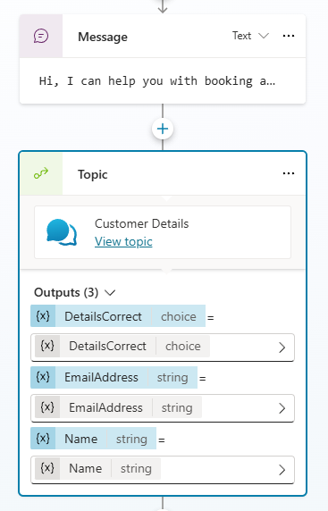

1. **[保存]** を選択します。

### タスク 5.5 - 条件ノードを追加する

1. **[トピック]** ノードの下にある **[+]** アイコンを選択し、**[条件の追加]** を選択します。

1. **[Condition]** ノードで、**[DetailsCorrect]** 変数を選択します。

1. **[is equal to]** を選択します。

1. **[はい]** を選択します。

   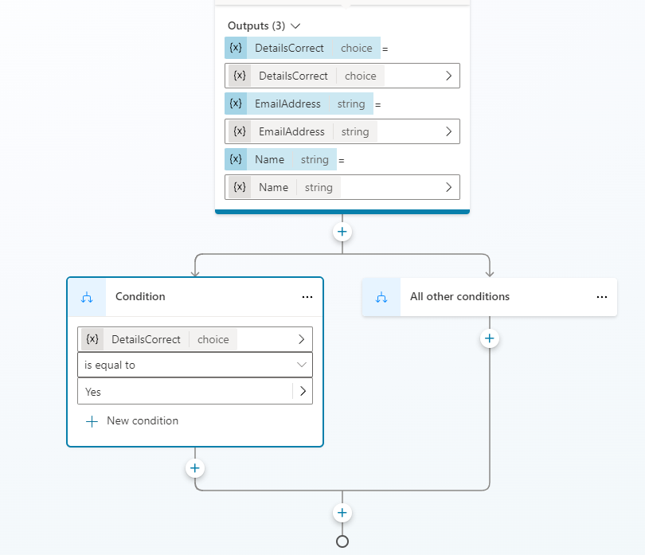

1. **[保存]** を選択します。

### タスク 5/6 - 質問ノードを追加する

1. 左側の **[条件]** ノードの下にある **[+]** アイコンを選択し、**[質問する]** を選択します。

1. **"Enter a message"** フィールドに、次のテキストを入力します。

   `What date and time would you like to book the repair estimate?`

1. **[Identify]** で **[Date and time]** を選択します。

1. **[Save user response as]** で変数を選択し **[Variable name]** に「**`VisitDateTime`**」と入力します

1. 左側の **[質問]** ノードの下にある **[+]** アイコンを選択し、**[メッセージの送信]** を選択します。

1. **"Enter a message"** フィールドに、次のテキストを入力します。

   `Great! Let me get that scheduled for you.`

1. そのメッセージ ノードの後に、ノードを追加し、**[トピックの管理]** \> **[すべてのトピックを終了する]** を選択してトピックを終了します。

1. **[保存]** を選択します。

### タスク 5.7 - エージェントへの指示を更新する

1. **[概要]** タブを選択します。

1. **[指示]** セクションで、**[編集]** を選択します。

1. エージェントへの指示の *# Skills* で「`Use the`」、「`/`」の順に入力し、**[修理を見積もる]** トピックを選択して、「`when a repair estimate is required.`」と入力します。

   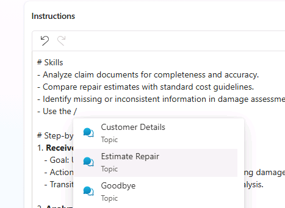

1. **[保存]** を選択します。

## 演習 6 - エージェントをテストする

この演習では、トピックのルーティングをテストし、会話が予想されるステップごとのフローに従うことを確認します。

### タスク 6.1 - [修理を見積もる] トピックをテストする

1. ページの右上にある **[テスト]** アイコンを選択して、**[テスト]** ペインを開きます。

1. **[テスト]** ペインで、変数 **{x}** アイコンの横にある省略記号 (**[...]**) を選択し、**[テスト時にアクティビティ マップを表示する]** を **[オン]** に切り替え、**[トピック間を追跡する]** を **[オフ]** に切り替えます。

   ![[アクティビティ マップを表示する]。](../media/show-activity-map.png)

1. **[テスト]** ペインの上部にある **[新しいテスト セッションの開始] **アイコン (**[+]**) を選択します。

1. **会話の開始**メッセージが表示されたら、エージェントによって会話が開始されます。 応答として、次のテキストを入力してトピックをトリガーします。

   `I need to book a repair estimate`

1. 会話はまず、顧客の名前を尋ねることから始める必要があります。

   ![[会話] のスクリーンショット。](../media/topic-conversation-1.png)

1. 名前を指定します。

1. メール アドレスを入力します。

1. 情報を入力すると、入力した情報がアダプティブ カードに表示され、詳細が正しいかどうかを確認します。 **[はい]** を選択します。

   会話フローが **[修理を見積もる]** トピックに戻っていることに注意してください。

1. **[修理の見積もりの予約日時を指定してください]** プロンプトに、「`Tomorrow 10:00 AM`」と入力します。

   エージェントは、修理の見積もりがスケジュールされたことを示す確認メッセージで応答します。

## まとめ

このラボでは、生成 AI を有効にしたまま、[顧客の詳細] トピックと [修理を見積もる] トピックを作成し、ノードを使用して、構造化されたステップごとの対話を適用しました。 また、[顧客の詳細] で収集された情報をトピック間で使用できるように、変数のスコープも構成しました。
