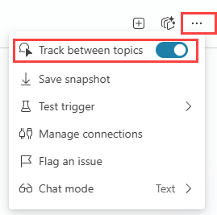
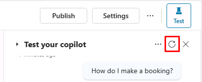
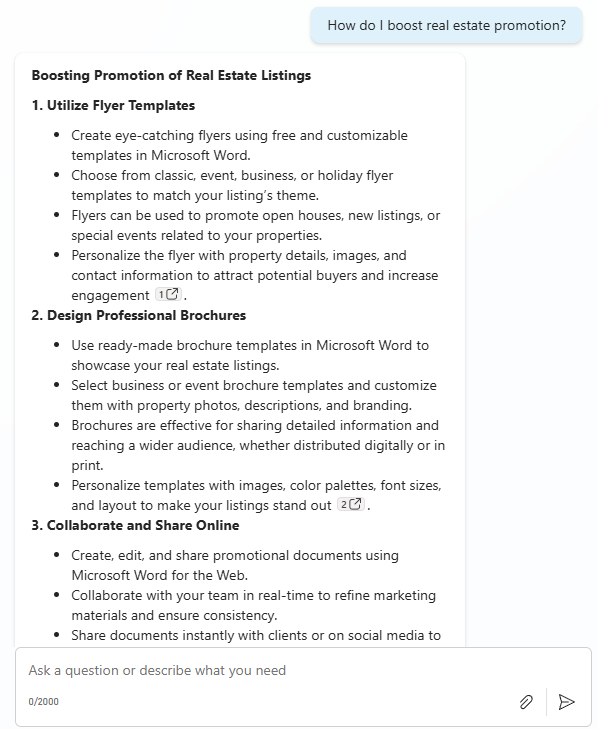

---
lab:
  title: 最初のエージェントを構築する
  module: Manage topics in Microsoft Copilot Studio
---

# 最初のエージェントを構築する

## シナリオ

この演習では、次のことを行います。

- エージェントを作成して名前を付ける
- 指示を使用してエージェントがどのように動作するかを定義する
- パブリック Web サイトをナレッジ ソースとして追加する

この演習の所要時間は約 **15** 分です。

## 学習する内容

- 自然言語を使用してエージェントを作成する方法
- エージェントの指示が生成動作にどのように影響するか
- 構成された知識によって生成 AI の応答がどのように機能するか

## ラボ手順の概要

- 新しいエージェントを作成する
- 指示を使用してエージェントの動作を定義する
- 生成 AI のナレッジ ソースを追加する
  
## 前提条件

- **ラボ: Dataverse ソリューションのインポート**を完了している必要があります

## 演習 1 - エージェントを作成する

この演習では、Microsoft Copilot Studio ポータルにアクセスし、適切な環境を選択して、新しいエージェントを作成します。

### タスク 1.1 – Bookings ソリューションでエージェントを作成する

1. 新しいブラウザー タブで、`https://copilotstudio.microsoft.com` に移動します。

1. 適切な環境にいることを確認します。

1. 左側のナビゲーションで、**[エージェント]** を選択します。

1. **[空のエージェントの作成]** \> **[高度な作成]** の横にある矢印を選択します。

1. **[ソリューション]** が既定で **[Bookings]** になっていることを確認します。

1. **[Schema Name]** に「`labagent`」と入力します。

1. **[確認して作成する]** を選択します。

エージェントの設定が開始されます。 プロビジョニングが完了したら、エージェントの構成を続行できます。

### タスク 1.2 – エージェントの詳細と指示を構成する

1. **詳細** セクションで **編集** を選択します

1. **[Name]** テキスト ボックスに「**`Real Estate Booking Service`**」と入力します。

1. **[Description]** テキスト ボックスに「**`Create bookings for real estate properties`**」と入力します。

1. **[保存]** を選択します。

1. **[手順]** セクションの **[編集]** を選択します

1. 指示を次のように更新します。

    ```prompt
    You are a real estate booking assistant.
    Help users with questions related to real estate properties and booking showings by using the knowledge and data that are available to you.

    When responding:
    Use the information provided through your configured knowledge sources whenever possible.
    If a user’s request is unclear or missing required details, ask a follow‑up question to gather the information you need.
    If you do not have enough information to answer confidently, do not guess. Instead, explain what information is missing or guide the user to provide it.
    
    Keep responses clear, helpful, and focused on assisting the user with booking‑related tasks.
    ```

1. 指示を**保存**します。

    > **注**:エージェントの指示はエージェントの動作をガイドしますが、動作を厳密に強制するものではありません。 以降のラボで、トピック、制限付きのナレッジ ソースを使用した生成応答、フォールバック構成を使用して、この動作を予測可能にする方法について学習します

1. 右側の **[エージェントのテスト]** ペインで「**`How do I make a booking?`**」と入力して応答を表示します。

このウィンドウは開いたままにします。

## 演習 2 - 生成 AI の回答を追加する

この演習では、エージェントが応答を生成するために使用できる知識を追加します。

### タスク 2.1 - ナレッジ ソースを追加する

1. **[Knowledge]** タブを選択します。

    ![Copilot Studio ポータルの [Knowledge] タブ。](../media/knowledge-tab.png)

1. **[+ Add knowledge]** を選択します。

1. **[Public websites]** を選択する

1. **"Public website link"** テキスト ボックスに「**`https://www.realtor.com/marketing/resources`**」と入力します。 この公開用 Web サイトには、エージェントに役立つ可能性のある不動産マーケティングのヒントがあります。

1. **[追加]** を選択します。

1. **[エージェントへの追加]** を選択します。

### タスク 2.1 - 生成 AI の応答をテストする

1. **[概要]** タブを選択します。

1. **省略記号 […]**  メニュー (**[エージェントのテスト]** ペインの上部) を選択します。

1. **[Track between topics]** を有効にします。

    

1. **[エージェントのテスト]** ペインの上部にある **[新しいテスト セッションの開始]** アイコンを選択します。

    

1. テキスト ボックスに、**`How do I boost real estate promotion?`** と入力して、応答を表示します。

    


## まとめ
このラボでは、エージェントを作成し、指示を使用してそれに予想される動作を定義しました。 また、ナレッジ ソースとしてパブリック Web サイトを追加し、ナレッジ ソースが回答に役立つ可能性がある質問でエージェントをテストしました。 これらの指示は生成応答をガイドしますが、後のラボでは、トピック、エンティティ、ツール、フォールバック構成を使用して予測可能な動作を適用する方法を紹介します
