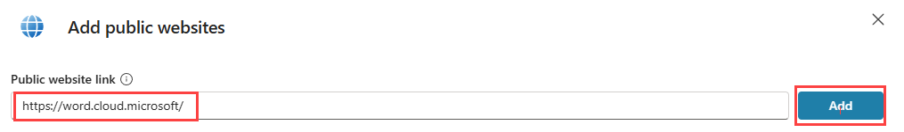

---
lab:
  title: 最初のエージェントを構築する
  module: Manage topics in Microsoft Copilot Studio
---

# 最初のエージェントを構築する

## シナリオ

この演習では、次のことを行います。

- エージェントを作成して名前を付ける
- エージェントが行うべきタスクについての説明を追加する
- 生成 AI の回答を構成する

この演習の所要時間は約 **15** 分です。

## 学習する内容

- 自然言語を使用してエージェントを作成する方法
- 生成 AI の回答をエージェント用に構成する方法

## ラボ手順の概要

- 新しいエージェントを作成する
- その主な目的が何であり、どのように動作すべきかをエージェントに伝えます。
- 生成 AI への指示を構成する
  
## 前提条件

- **ラボ: Dataverse ソリューションのインポート**を完了している必要があります

## 演習 1 - エージェントを作成する

この演習では、Microsoft Copilot Studio ポータルの開発環境にアクセスし、新しいエージェントを作成します。

### タスク 1.1 – Bookings ソリューションでエージェントを作成する

1. 新しいブラウザー タブで、`https://copilotstudio.microsoft.com` に移動します。

1. 適切な環境にいることを確認します。

1. 左側のナビゲーションで、**[エージェント]** を選択します。

1. **[空のエージェントの作成]** \> **[高度な作成]** の横にある矢印を選択します。

1. **[ソリューション]** を **[Bookings]** に更新する

1. **[Schema Name]** に「`labagent`」と入力します。

1. **[確認して作成する]** を選択します。

### タスク 1.2 – エージェントを構成する

1. **詳細** セクションで **編集** を選択します

1. **[Name]** テキスト ボックスに「**`Real Estate Booking Service`**」と入力します。

1. **[Description]** テキスト ボックスに「**`Create bookings for real estate properties`**」と入力します。

1. **[保存]** を選択します。

1. **[手順]** セクションの **[編集]** を選択します

1. 手順を **`Create an agent for topics relating to creating bookings for real estate properties`** に更新して**保存**します。

1. 右側の **[エージェントのテスト]** ペインで「**`How do I make a booking?`**」と入力して応答を表示します。

このウィンドウは開いたままにします。

## 演習 2 - 生成 AI の回答を追加する

この演習では、Microsoft Copilot Studio ポータルにアクセスし、エージェントが生成 AI を使用して質問に回答するために使用する知識を追加します。

### タスク 2.1 - 生成オーケストレーションを無効にする

1. **設定**を選択します。

1. **[生成 AI オーケストレーションを使用して、エージェントの応答を生成しますか?]** に、**[いいえ - クラシック オーケストレーションを使用して、エージェントのトピックで定義されているコンテンツと動作に応答を制限します]** を選択します。 これにより、このラボの目的に合わせてオーケストレーションが無効になります。

1. **[保存]** を選択します。

1. [設定] ウィンドウを閉じます。

### タスク 2.2 - ナレッジ ソースを追加する

1. **[Knowledge]** タブを選択します。

    ![Copilot Studio ポータルの [Knowledge] タブ。](../media/knowledge-tab.png)

1. **[+ Add knowledge]** を選択します。

1. **[Public websites]** を選択する

1. **"Public website link"** テキスト ボックスに「**`https://word.cloud.microsoft/`**」と入力します。

    

1. **[追加]** を選択します。

1. **[エージェントへの追加]** を選択します。

1. **[概要]** タブを選択します。

1. **省略記号 […]**  メニュー (**[エージェントのテスト]** ペインの上部) を選択します。

1. **[Track between topics]** を有効にします。

    

1. **[エージェントのテスト]** ペインの上部にある **[新しいテスト セッションの開始]** アイコンを選択します。

    

1. **[質問するか、必要なものを説明してください]** テキスト ボックスに、「**`How do I boost real estate promotion?`**」と入力します。

    
