---
lab:
  title: Copilot Studio エージェントのナレッジを管理する
  module: Ground agents with knowledge sources
  description: このラボでは、Copilot を使用してエージェントを作成し、Dataverse テーブルを作成し、エージェントにナレッジを追加し、生成 AI を構成します。
  duration: 60 minutes
  level: 200
  islab: true
  primarytopics:
    - Microsoft Copilot Studio
---

# Copilot Studio エージェントのナレッジを管理する

## シナリオ

この演習では、次のことを行います。

- Dataverse テーブルの作成
- エージェントを作成する
- ナレッジ ソースとして使用するファイルをアップロードする
- パブリック Web サイトをナレッジ ソースとして追加する
- Dataverse テーブルをナレッジ ソースとして追加する
- 生成オーケストレーションの設定を構成する
- "生成型の回答を作成する" ノードを構成する
- エージェントを Microsoft Teams に公開する

この演習の所要時間は約 **60** 分です。

## 学習する内容

- ナレッジ ソースをエージェントに追加する方法
- 生成オーケストレーションと生成型回答の振る舞いを構成する方法

## ラボ手順の概要

- Copilot を使用して Dataverse テーブルを作成する
- Copilot を使用してエージェントを作成する
- ナレッジ ソースを追加する
- 生成 AI を構成する
- エージェントを発行する
  
## 前提条件

- Microsoft Entra ID アカウントを保有している
- Copilot Studio のライセンスを保有しているか、[無料試用版](https://go.microsoft.com/fwlink/p/?linkid=2252605)にサインアップ済みである。
- Power Platform の環境とソリューションにアクセスでき、エージェントと関連資産を作成できる状態である。
- 使用できるもの:
  - 「**ILT のセットアップ**」ラボで作成された環境と **Lab Exercises** ソリューション、または
  - あなた独自の既存の環境とソリューション。
- 環境とソリューションの準備がまだできていない場合は、次に進む前に「**ILT のセットアップ**」ラボのステップを完了してください。
  
> [!IMPORTANT]
> 現在プレビュー中の、新しい Copilot Studio エクスペリエンスが表示される場合があります。 これらのラボでは現行の Copilot Studio インターフェイスを使用しているため、ステップやスクリーンショットの中にはプレビューのエクスペリエンスとは異なるものもあります。 ラボを指示どおりに進めるには、現行の Copilot Studio UI をこれらの演習全体で使用してください。

## 鍵となる概念: エージェントのコンポーネントと振る舞い

生成オーケストレーションが有効化されているときは、エージェントは指示、ナレッジ、トピック、ツールを使用して動的に応答を生成できます。 複数の種類のナレッジ ソースをエージェントの典拠として使用可能であり、生成型応答がどのように生成されるかについては、さまざまな設定が影響を及ぼします。

## 演習 1 - Dataverse でテーブルを作成する

この演習では、エージェントのナレッジ ソースとして使用される Dataverse テーブルを作成します。

### タスク 1.1 - 経費申請用のテーブルを作成する

1. Web ブラウザーで **Power Apps Maker Portal** (`https://make.powerapps.com/`) にアクセスし、サインインします (要求された場合)。 ウェルカム メッセージはスキップします。

1. ページの上部に表示されている現在の環境が、この演習の作業用のものであることを確認します。

   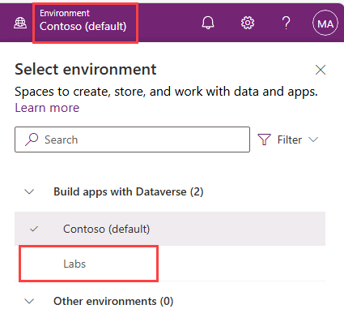

1. **Maker Portal** の左側のナビゲーション バーで、**[テーブル]** を選択します。

   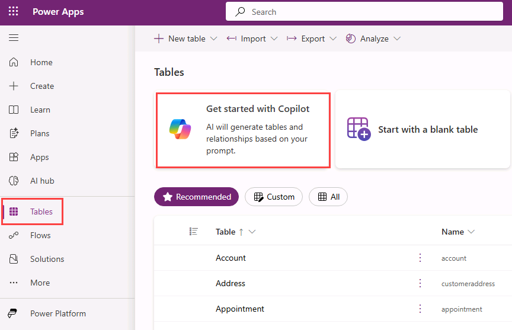

1. **[Copilot で開始する]** タイルを選択します。

1. **[Copilot で開始する]** ダイアログで、**[テーブルのオプション]** アイコンを選択し、**[1 つのテーブル]** を選択します。

   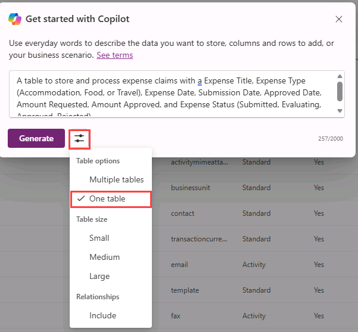

1. *[Copilot で構築するテーブルについて説明します]* テキスト ボックスに、次に示すプロンプトを入力します。

   ```prompt
   A table to store and process expense claims with an Expense Title, Expense Type (Accommodation, Meals, Entertainment or Travel), Expense Date, Submission Date, Approved Date, Amount Requested, Amount Approved, and Expense Status (Submitted, Evaluating, Approved, Rejected).
   ```

1. **[Generate] \(生成)** を選択します。
  
    > [!NOTE]
    > 生成されるテーブル スキーマは、このラボのスクリーンショットで示しているものとはわずかに異なる場合があります。 列名や書式に小さな違いがあることが想定されます。

1. テーブルが作成されます。 テーブルの名前を書き留めておきます。

   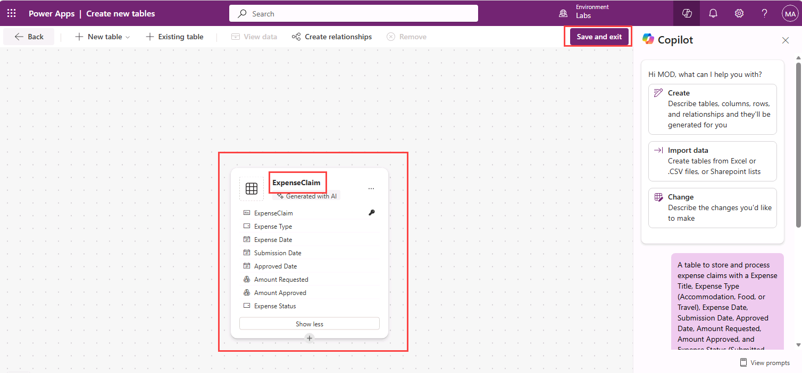

1. **[保存して終了]** を選択し、もう一度 **[保存して終了]** を選択します。

## 演習 2 - エージェントを作成する

この演習では、ある架空の企業の経費ポリシーに関する質問に答える新しいエージェントを、自然言語を使用して作成します。

### タスク 2.1 - 経費申請用のエージェントを作成する

1. **Copilot Studio** のホームページ `https://copilotstudio.microsoft.com/` に移動します。

1. ページの上部に表示されている現在の環境が、この演習の作業用のものであることを確認します。

1. 左側のナビゲーションで **[エージェント]** を選択します。

1. *[構築開始にあたって、エージェントに行わせたいことを説明してください]* テキスト ボックスの左下にある **[エージェントの設定]** アイコン (**歯車**の画像として表示されます) を選択します。

   

1. エージェントの主要言語の設定は **[英語 (米国)]** のままにします。

1. **[ソリューション]** ドロップダウンで **[Lab Exercises]** またはその他の、この演習に使用するソリューションを選択します。

1. [スキーマ名] に「`expenseagent`」と入力します。**

1. **[更新]** を選択します。

1. [構築開始にあたって、エージェントに行わせたいことを説明してください] テキスト ボックスに、次のプロンプトを入力します。**

   ```prompt
   You are an agent that helps employees with expense claims including questions around expense policy and procedures.
   ```

1. **[送信]** アイコンを選択します。

   エージェントのプロビジョニングが完了したら、エージェントの構成に進むことができます。

## 演習 3 - ナレッジをエージェントの典拠とする

この演習では、エージェントの典拠となるナレッジ ソースをエージェントに追加します。

### タスク 3.1 - ドキュメントをナレッジ ソースとして追加する

1. 新しいブラウザー タブを開き、`https://github.com/MicrosoftLearning/mslearn-copilotstudio/raw/main/expenses/Expenses_Policy.docx` に移動して、[経費ポリシー ドキュメント](https://raw.githubusercontent.com/MicrosoftLearning/mslearn-copilotstudio/main/expenses/Expenses_Policy.docx)をローカルにダウンロードします。 このドキュメントの内容は、この架空の企業の経費ポリシーの詳細です。

1. 演習 3 で作成したエージェントが表示されている **Copilot Studio** のブラウザー タブに戻ります。

1. **[ナレッジ]** タブを選択して、作成したエージェントの中で定義されているナレッジ ソースを確認します (この時点では何もないはずです)。

   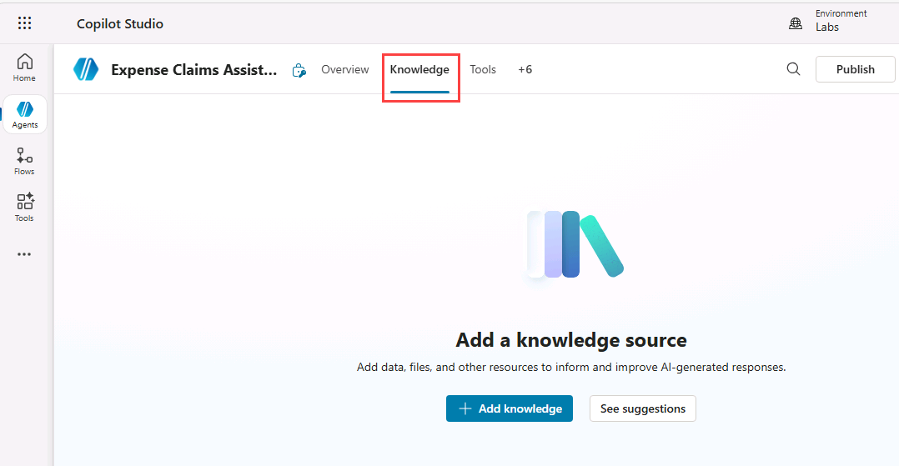

1. **[+ Add knowledge]** を選択し、エージェントに追加できる複数の種類のナレッジ ソースを確認します。

   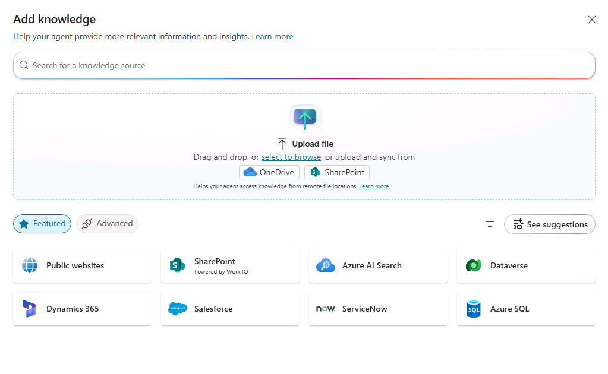

1. **[ファイルをアップロードする]** セクションで、**[選択して参照]** を使用して前にダウンロードした経費ポリシー ドキュメントをアップロードし、**[エージェントへの追加]** を選択します。

   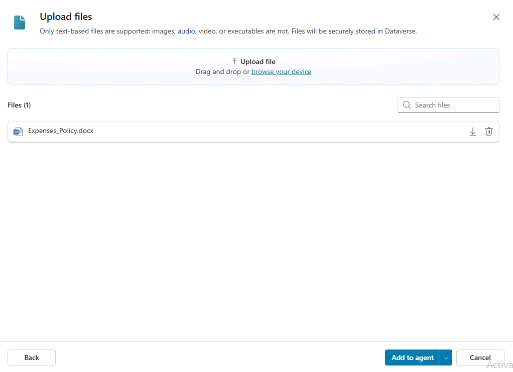

> [!NOTE]
> ファイルのアップロード後に、Copilot Studio でのインデックス作成が開始します。 これには 10 分以上かかる場合があるため、次の演習の後に戻って確認してください。

### タスク 3.2 - 公開 Web サイトをナレッジ ソースとして追加する

1. Copilot Studio エージェントの画面で、**[ナレッジ]** タブを選択します。

1. **[+ Add knowledge]** を選択します。

1. **[公開 Web サイト]** を選択します。

1. **"Public website link"** テキスト ボックスに「**`https://www.irs.gov/publications/p463`**」と入力します。 この米国政府公式の公開 Web サイトには、あなたが作成するエージェントに役立つ可能性のある、出張費用精算に関する詳細が掲載されています。

1. **[追加]** を選択します。

1. *名前*には、`Travel, Gift, and Car Expenses | Internal Revenue Service`を入力します。

1. [説明] に「`This knowledge source contains information on reimbursement of travel expenses.`」と入力します。**

1. **[エージェントへの追加]** を選択します。
> [!NOTE]
> 公開 Web サイトのインデックス作成には数分かかることがあります。 応答が不完全である場合は、数分待ってからもう一度エージェントをテストしてください。

### タスク 3.3 - Dataverse テーブルをナレッジ ソースとして追加する

1. Copilot Studio エージェントの画面で、**[ナレッジ]** タブを選択します。

1. **[+ Add knowledge]** を選択します。

1. **Dataverse** を選択します。

1. 演習 2 で作成した *Expenses* テーブルを検索して選択します。

   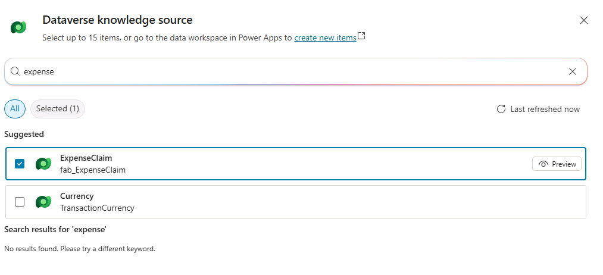

1. **[エージェントへの追加]** を選択します。

   

### タスク 3.4 - Dataverse ナレッジ ソースを構成する

1. Copilot Studio エージェントの画面で、**[ナレッジ]** タブを選択します。

1. Dataverse テーブルの省略記号 (**⋮**) を選択し、**[編集]** を選択します。

   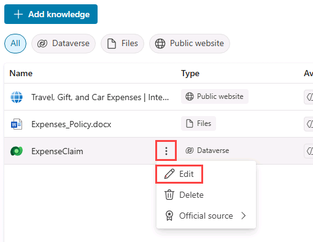

1. **[詳細]** タブで、名前を「`Expense Claims data`」と入力します。**

1. **[同義語]** タブを選択します。

1. **Expense Type** の行の **[+ 同義語の追加]** を選択します。

1. 「`Expense label`」と入力して **[追加]** を選択します。

1. 「`Expense category`」と入力して **[追加]** を選択します。

   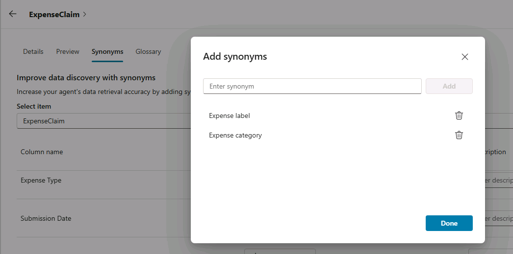

1. **完了** を選択します。

1. **[用語集]** タブを選択します。

1. "用語を入力します" のところに「`Incidental expenses`」と入力します。**

1. "説明を入力します" のところに「`Minor, necessary business costs that arise in addition to a primary expense such as tips or fees.`」と入力します。**

1. **[保存]** を選択します。

### タスク 3.5 - ファイルのインデックス作成の進行状況を確認する

アップロードしたファイルのインデックス作成が完了しているかどうかを調べます。 インデックス作成がまだ進行中の場合は、数分待ち、ページを最新の情報に更新してから次に進んでください。

1. **[Knowledge]** タブを選択します。

1. ファイルのアップロードの**状態**を確認します。 まだ **[進行中]** の場合は、**[準備完了]** になるまで数分ごとに更新します。

### タスク 3.6 - 典拠をテストする

1. ページの右上にある **[テスト]** アイコンを選択してテストのペインを開きます。

1. **[テスト]** ペインで、変数 **{x}** アイコンの横にある省略記号 (**...**) を選択し、**[テスト時にアクティビティ マップを表示する]** を **[オン]** に切り替え、**[トピック間の追跡]** を **[オフ]** に切り替えます。

   

1. **[テスト]** ペインの上部にある **[新しいテスト セッションを開始する]** アイコン **+** を選択します。

1. 次のプロンプトを入力します。

   `What can I claim for expenses?`

1. 応答の典拠として、アップロード済みの経費ポリシー ドキュメントが使用されるはずであり、他の構成済みのナレッジ ソースが参照されることもあります。

   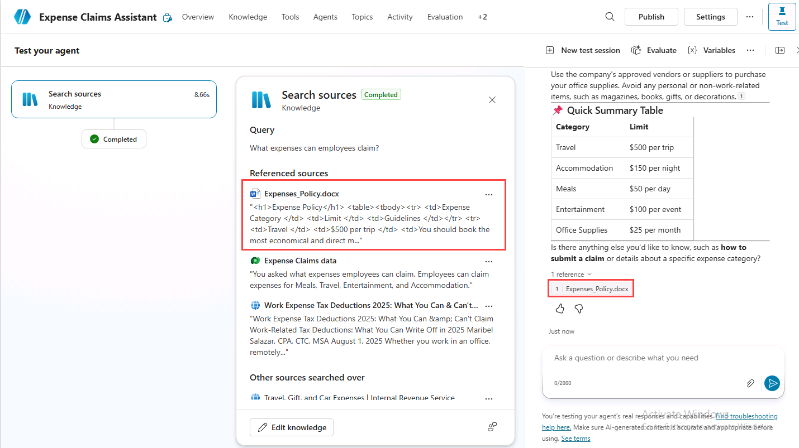

1. **[テスト]** ペインの上部にある **[新しいテスト セッションを開始する]** アイコン **+** を選択します。

1. 次のプロンプトを入力します。

   `What is the total amount of all expense claims for each category?`

1. エージェントはすべてのナレッジ ソースを検索し、Dataverse テーブルを使用して応答を生成するはずです。

   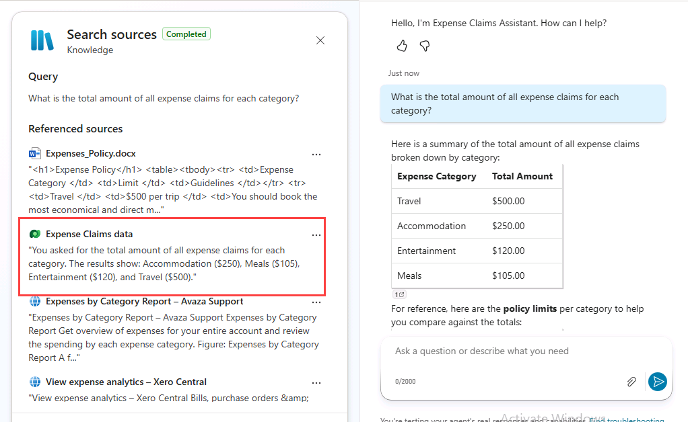

1. **[テスト]** ペインの上部にある **[新しいテスト セッションを開始する]** アイコン **+** を選択します。

1. 次のプロンプトを入力します。

   `What is the standard deduction for incidental expenses?`

1. エージェントはすべてのナレッジ ソースを検索し、公開 Web サイトを使用して応答を生成するはずです。

   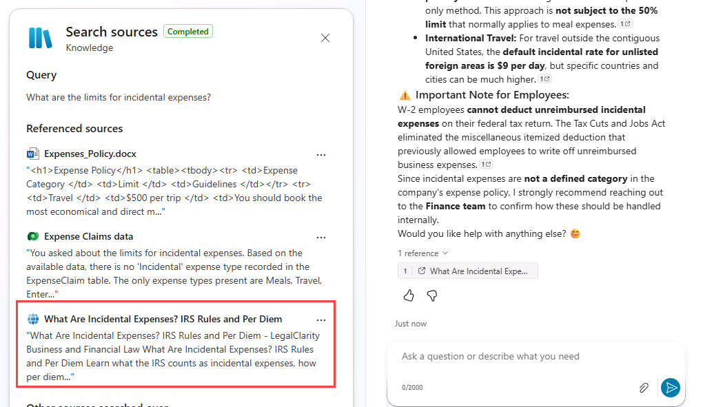

## 演習 4 - 生成 AI の設定

この演習では、生成 AI をエージェントに対して、および生成型回答ノードに対して構成します。

### タスク 4.1 - エージェント ナレッジの設定を構成する

1. エージェントのページの右上にある **[設定]** ボタンを選択します。

1. **[オーケストレーション]** が **[はい、利用できるツールやナレッジを適宜使用し、応答を動的にします]** に設定されていることに注目します。

1. **[ナレッジ]** セクションの **[根拠のない応答を許可する]** を **[オフ]** に設定します。

1. **[ナレッジ]** セクションの **[Web の情報を使用する]** を **[オフ]** に設定します。

   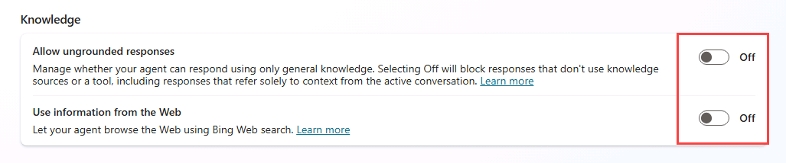

1. **[保存]** を選びます。

1. [設定] ページの右上にある **[X]** を選択して設定を閉じます。

1. 前の演習のプロンプトを使用してエージェントをテストします。 ファイルと Dataverse のナレッジ ソースは応答の生成に使用されますが、公開 Web サイトは使用されません。

### タスク 4.2 - 生成型回答ノードを構成する

1. **[Topics]** タブを選択します。

1. **[システム]** トピックでフィルター処理します。

1. **[会話強化]** トピックを開きます。

1. **[会話を Copilot でブーストする]** ダイアログが表示された場合は、**[完了]** を選択します。

1. **[生成応答の作成]** ノードを選択します。

   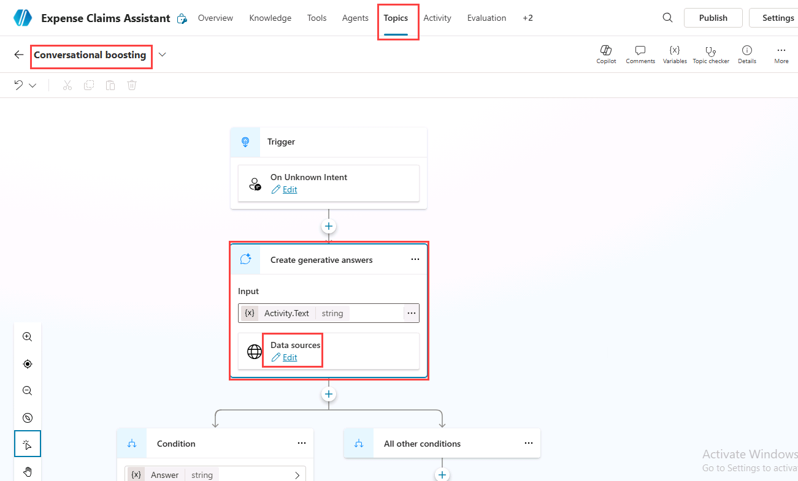

1. **[データ ソース]** で **[編集]** を選択します。

1. **[選択したソースのみを検索する]** を選択して有効にします。

1. **公開 Web サイト**のナレッジ ソースを選択します。

1. **[Web 検索]** を選択して有効にします。
  Web 検索が有効化されているときは、生成型回答において、構成済みのナレッジ ソースの補完として公開 Web 情報を利用できます。
   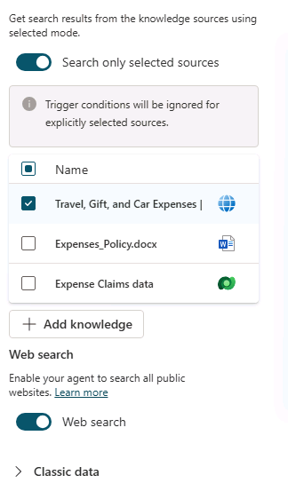

1. **[保存]** を選択します。

1. **[概要]** タブを選択します。

1. ページの右上にある **[テスト]** アイコンを選択してテストのペインを開きます。

1. **[テスト]** ペインで、変数 **{x}** アイコンの横にある省略記号 (**...**) を選択し、**[テスト時にアクティビティ マップを表示する]** を **[オフ]** に切り替え、**[トピック間の追跡]** を **[オン]** に切り替えます。

1. **[テスト]** ペインの上部にある **[新しいテスト セッションを開始する]** アイコン **+** を選択します。

1. 次のプロンプトを入力します。

   `What is the federal per diem rate?`

1. ナレッジ ソースからは回答が得られませんが、エージェントは生成型回答を使い、Web を検索して応答を生成します。

   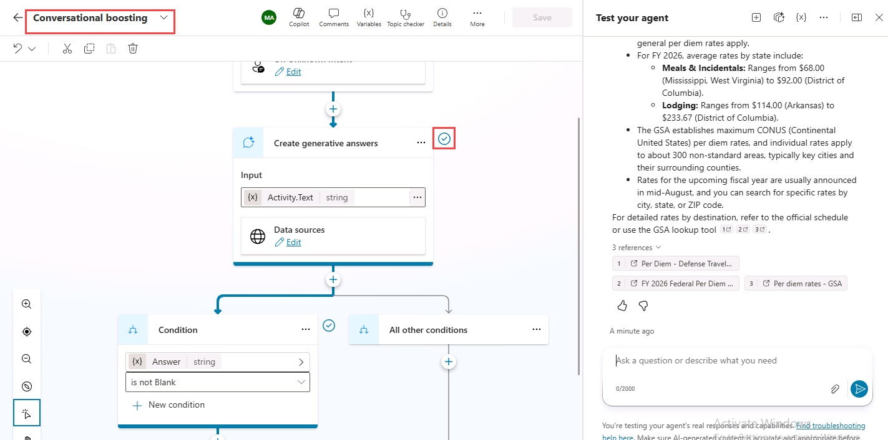

### タスク 4.3 - フォールバック トピック

1. **[Topics]** タブを選択します。

1. **[システム]** トピックでフィルター処理します。

1. **[会話強化]** トピックを開きます。

1. **[生成応答の作成]** ノードを選択します。

1. **[データ ソース]** で **[編集]** を選択します。

1. **[Web 検索]** を無効にします。

1. **[保存]** を選択します。

1. **[概要]** タブを選択します。

1. ページの右上にある **[テスト]** アイコンを選択してテストのペインを開きます。

1. **[テスト]** ペインで、変数 **{x}** アイコンの横にある省略記号 (**...**) を選択し、**[テスト時にアクティビティ マップを表示する]** が **[オフ]** に、**[トピック間の追跡]** が **[オン]** に設定されていることを確認します。

1. **[テスト]** ペインの上部にある **[新しいテスト セッションを開始する]** アイコン **+** を選択します。

1. 次のプロンプトを入力します。

   `What is the federal per diem rate?`

1. ナレッジ ソースと生成型回答からは回答が得られません。 典拠に基づく、あるいは生成型の適切な応答が返せない場合に、会話をフォールバック トピックに進めることができます。

   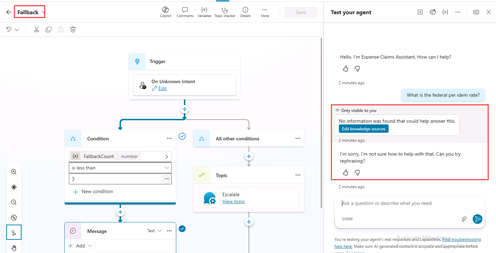

## 演習 5 - エージェントを Microsoft Teams に公開する

この演習では、エージェントを Microsoft Teams に公開します。最初に、Microsoft Entra ID 認証が有効化されていることを確認します。

### タスク 5.1 - Microsoft Entra ID 認証

1. エージェントのページの右上にある **[設定]** ボタンを選択します。

1. **[設定]** ページの左側で **[セキュリティ]** を選択します。

1. **認証**を選択します。

1. **[Microsoft で認証する]** がまだ選択されていない場合は選択します。

1. **[保存]** を選択し、もう一度 **[保存]** を選択します。

1. **[設定]** ページの右上にある **[X]** を選択して設定を閉じます。

### タスク 5.2 - エージェントを公開する

1. エージェントのページで **[公開]** を選択し、もう一度 **[公開]** を選択して確定します。

### タスク 5.3 - Microsoft Teams チャネル
> [!NOTE]
> このラボでの Teams への公開は、テストと学習を目的としています。 本番環境での展開では、追加のガバナンス、セキュリティ、アプリ承認のプロセスが必要になる可能性があります。

1. **チャネル** タブを選択します。

   ![Copilot Studio の [チャネル] タブのスクリーンショット。](../media/channels-tab-teams.png)

1. **[Microsoft 365 と Microsoft Teams]** タイルを選択します。

1. **[エージェントを Microsoft 365 Copilot で利用可能にする]** を選択解除します。

1. **[チャネルを追加]** を選択します。

   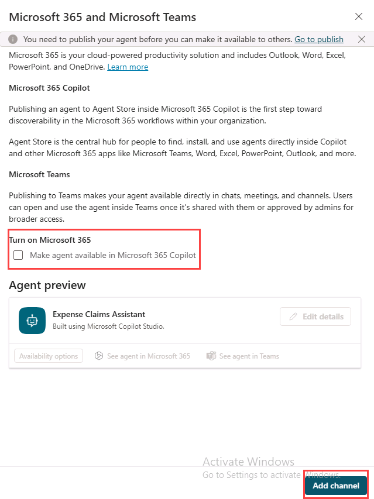

1. **[Teams でエージェントを表示する]** を選択します。

1. **"このサイトは Microsoft Teams (職場または学校) を開こうとしています"** のダイアログ ボックスで **[キャンセル]** を選択します。

1. ポップアップで **[キャンセル]** を選択し、**[代わりに Web アプリを使用する]** を選択します。

1. **[追加]** を選択してエージェントを Teams に追加します。

   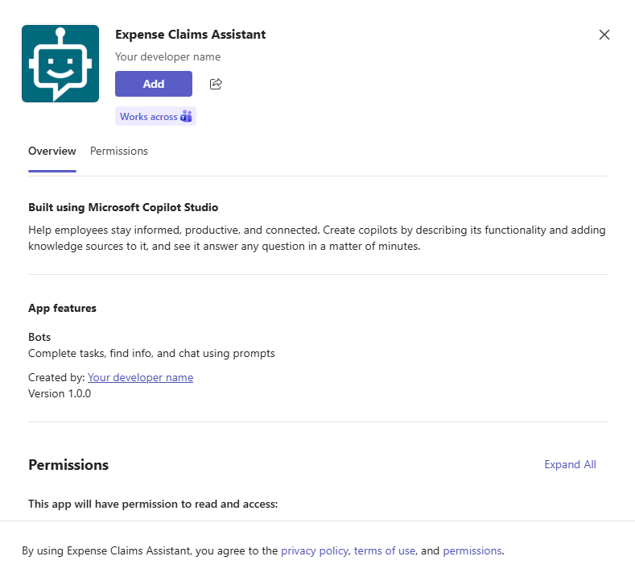

1. **[開く]** を選択し、エージェントが Teams に読み込まれるのを待ちます。

1. 公開されたエージェントを Microsoft Teams でテストします。

    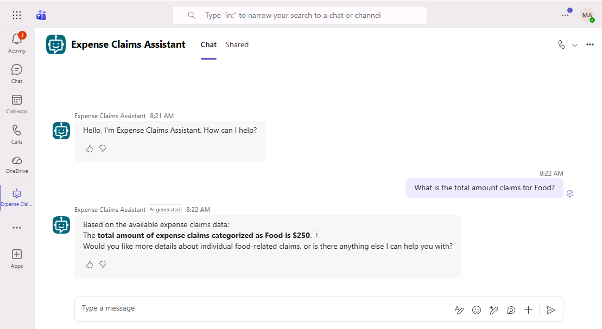

## まとめ

このラボでは、エージェントにナレッジ ソースを追加し、そのナレッジ ソースがプロンプトへの応答の生成時にいつどのように使用されるかに関して生成 AI の設定がどのように影響を及ぼすかを調べました。
