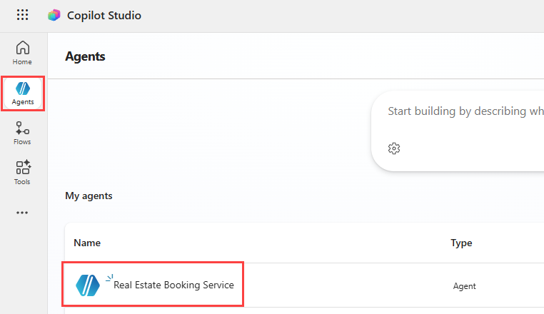
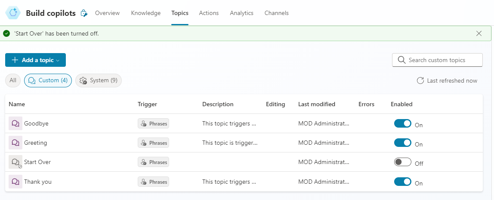
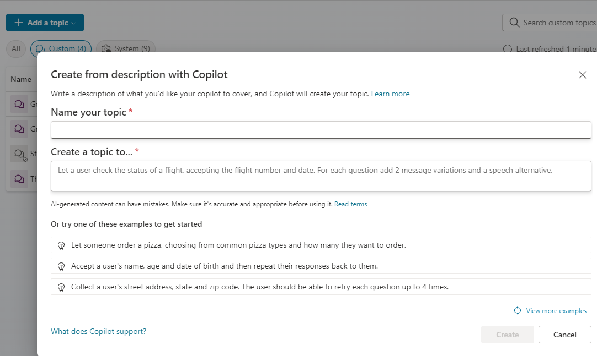

---
lab:
  title: トピックの管理
  module: Manage topics in Microsoft Copilot Studio
---

# トピックの管理

## シナリオ

この演習では、次のことを行います。

- 既存のトピックを管理する
- Copilot を使用してトピックを作成および編集する
- トピックを手動で作成し、トリガー フレーズを追加する

この演習の所要時間は約 **30** 分です。

## 学習する内容

- トピックがどのようにして生成 AI の応答を補完するのか
- どのようなときにトピックを使用して構造化された会話を適用するのか
- どのようにして自然言語を使用してトピックの作成と調整を行うのか

## ラボ手順の概要

- 不要なトピックを確認および無効化する
- Copilot を使用してトピックを作成する
- 自然言語を使用してトピックの内容を編集する
- 生成 AI を有効にしてトピックの動作をテストする
  
## 前提条件

- **ラボ: 最初のエージェントを構築する**を完了している必要があります


## 主要な概念:トピックと生成 AI
生成 AI を有効にすると、エージェントはトピックをトリガーせずに質問に動的に応答できます。 これは正しい動作です。

トピックは、次の操作が必要な場合に使用します。
- 必要な情報をステップごとに収集する
- 質問の順序を制御する
- 変数に応答を格納する
- 予測可能な結果を維持する

以降のラボでは、ノード、エンティティ、ツールと共にトピックを使用して、エージェントの動作を適用します。

## 詳細な手順

## 演習 1 - トピックをレビューおよび無効化する

この演習では、既存のトピックをレビューし、不要なトピックを無効にします。

### タスク 1.1 - トピックを無効にする

1. Microsoft Copilot Studio ポータル `https://copilotstudio.microsoft.com` に移動し、適切な環境にあることを確認します。

1. 左側のナビゲーション ウィンドウから **[エージェント]** を選択します。

1. 前のラボで作成した **[Real Estate Booking Service]** エージェントを選択します。

    

1. **[Topics]** タブを選択します。

1. **[やり直す]** トピックを見つけます。

1. **[Start Over]** トピックの **[Enabled]** を **[Off]** に切り替えます。

    

未使用のトピックを無効にすると、複数のトピックまたは生成応答で同じ要求を処理できる場合のあいまいさが軽減されます。

## 演習 2 - 自然言語でトピックを作成する

この演習では、Copilot を使用して説明からトピックを作成します。 これにより、生成 AI が初期構造を下書きして、それを調整することができます。

### タスク 2.1 – 説明からトピックを追加する

1. **[+ トピックの追加]** を選択し、**[Copilot を使用して説明から追加]** を選択します。 新しいウィンドウが開きます。

    

    

1. **[Name your topic]** テキスト ボックスに「**`Customer Details`**」と入力します。

1. **[トピックを作成する目的]** テキスト ボックスに「**`Ask the customer for their name and email address`**」と入力します。

1. **［作成］** を選択します

1. **[保存]** を選択します。

### タスク 2.2 – 自然言語を使用してトピックの内容を編集する

1. **[エージェントのテスト]** ペインが開いている場合は、ペインを閉じます。

1. **[Customer Details]** ペインの右側に **[Edit with CoPilot]** ペインが表示されない場合は、作成キャンバスの上部にある**Copilot** アイコンを選択します。

    ![[Copilot で編集] アイコンのスクリーンショット。](../media/edit-with-copilot.png)

1. 2 番目の **[質問]** ノードである **[What is your email address?]** を選択します。

    ![[Copilot で編集] アイコンのスクリーンショット。](../media/copilot-email-address-node.png)

1. **Copilot で編集**パネルで、**何の操作を実行しますか?** フィールドに、次のテキストを入力します。

    `Change "What is your email address?" to say thank you to the Name variable from the previous node and then proceed to ask the email address question.`

1. **[更新]** を選択します。

    ![プロンプトを含む [Copilot で編集] パネルのスクリーンショット。](../media/edit-with-copilot-panel.png)

    

    > **注**: メッセージは、先ほどのノードの *Name* 変数を含むように更新されるはずです。上記のスクリーンショットのようになります。 [コパイロットで編集する] で質問ノードが正しく更新されなかった場合は、[元に戻す] を選択し、別のプロンプトでもう一度試します。

1. **[保存]** を選択します。

### タスク 2.3 – 自然言語を使用して要約を追加する

既存のノードを更新する他に、Copilotを 使用して新しいノードを追加できます。

1. 作成キャンバス上の空の領域をクリックすると、ノードが選択されません。

1. **Copilot で編集**パネルで、**何の操作を実行しますか?** フィールドに、次のテキストを入力します。

    `Summarize the information collected in an adaptive card`

1. **[更新]** を選択します。

トピックの末尾に、アダプティブ カードを含むメッセージ ノードが追加されます。


1. アダプティブ カードの **[Media]** ボックスを選択します。 画面の右側にアダプティブ カードのプロパティが表示されます。

    

   アダプティブ カードの式は、上記のようになります。 このようになっていない場合は、以下の式を貼り付けることができます。

    ```json
    {
    type: "AdaptiveCard", 
        body: 
        [
            {
                type: "TextBlock",
                size: "Medium",
                weight: "Bolder",
                text: "Summary"    
            },
            {
                type: "FactSet",
                facts: 
                [
                    {
                        title: "Full Name",
                        value: Text(Topic.Name)
                    },
                    {
                        title: "Email Address",
                        value: Text(Topic.EmailAddress)
                    }
                ]
            },
            {
                type: "TextBlock",
                text: "Thank you for providing the information."
            }
        ]
    }
    ```

1. 作成キャンバス内の空白部分を選択して、ノードが選択されていないことを確認します。

1. **Copilot** アイコンを選択して、**[Copilot で編集]** ペインを再度開きます。

1. **何の操作を実行しますか?** フィールドに、次のテキストを入力します。

    `Add a new multiple choice question to prompt the user if the details are correct with two options Yes or No`

1. **[更新]** を選択します。

1. トピックの末尾に、ユーザーが選択できるオプションを含む新しい質問ノードが追加されます。

    

1. **[保存]** を選択します。

以降のラボでは、この応答を使用して分岐ロジックを制御し、予測可能な動作を適用します。

## 演習 3 - トピックをテストする

1. [テスト] ペインを再度開くには、ページの右上にある**テスト** アイコンを選択します。

1. テスト パネルの上部にある **[新しいテスト セッションの開始]** アイコンを選択します。

    

1. テキスト ボックスに、「**`Customer information`**」と入力します。

1. プロンプトが表示されたら、名前とメール アドレスを指定します。

1. 詳細の確認を求められたら **[はい]** を選択します。

1. **[保存]** を選びます。

エージェントがどのようにしてトピックを使用して会話を制御し、必要な情報をステップごとに収集し、自由形式の生成応答を一時的にオーバーライドするかを確認してください。
