---
lab:
  title: ワークフローをツールとして使用する
  module: Incorporate workflows to enhance agent behavior
  description: このラボでは、Copilot を使用して、エージェントとワークフローを作成し、ワークフローをツールとしてエージェントとトピックに追加します。
  duration: 45 minutes
  level: 200
  islab: true
  primarytopics:
    - Microsoft Copilot Studio
---

# ワークフローをツールとして使用する

## シナリオ

この演習では、次のことを行います。

- エージェントを作成する
- ワークフローの作成
- ワークフローをツールとして追加する
- エージェントとトピックでツールを使用する
- エージェントをテストする

この演習の所要時間は約 **45** 分です。

## 学習する内容

- ワークフローを使用して、エージェントで決定論的なアクションを実行できるようにする方法
- ワークフローをツールとして設定する方法
- トピックでワークフローを使用する方法

## ラボ手順の概要

- Copilot を使用してエージェントを作成する
- Microsoft Teams にメッセージを送信するワークフローを作成する
- ワークフローをツールとしてエージェントに追加する
- ワークフローを作成し、トピックに追加する
  
## 前提条件

- Microsoft Entra ID アカウントを持っている
- Copilot Studio のライセンスを持っているか、[無料試用版](https://go.microsoft.com/fwlink/p/?linkid=2252605)にサインアップしている。
- Power Platform 環境と、エージェントや関連資産を作成できるソリューションにアクセスできる。
- Microsoft Teams へのアクセス権と Teams チャンネルにメッセージを投稿するためのアクセス許可がある。
- 使用できるもの:
  - 「**ILT のセットアップ**」ラボで作成された環境と **[ラボ演習]** のソリューション、または
  - 独自の既存の環境とソリューション。
- 環境とソリューションをまだ準備していない場合は、続行する前に「**ILT のセットアップ**」ラボの手順を完了してください。
  
> [!IMPORTANT]
> 現在プレビュー段階にある新しい Copilot Studio エクスペリエンスが表示される場合があります。 以下のラボでは現在の Copilot Studio インターフェイスを使用するため、一部の手順やスクリーンショットがプレビュー段階のエクスペリエンスと一致しない可能性があります。 指示に従ってラボを正常に完了するには、以下の演習中は現在の Copilot Studio UI を使用してください。

## 主要な概念: エージェントのコンポーネントと動作

生成オーケストレーションを有効にすると、エージェントは指示、知識、トピック、ツールを使用して応答を動的に生成できます。 エージェントはツールを使用して外部システムでアクションを実行し、データを取得し、メッセージを送信できます。 ツールは通常、アクションの実行や外部データの取得に使用され、トピックは構造化された会話フローをガイドします。

## 演習 1 - エージェントを作成する

この演習では、自然言語を使用して新しいエージェントを作成し、タスクの分析、分類、優先順位付けを行います。

### タスク 1.1 – タスクを分析するエージェントを作成する

1. **Copilot Studio** のホーム ページ (`https://copilotstudio.microsoft.com/`) で、この演習に使用する環境で作業していることを確認します。

1. 左側のナビゲーションで、**[エージェント]** を選択します。

1. "構築を開始するにあたって、エージェントに何をしてほしいかを説明してください" テキスト ボックスの左下で、**[エージェントの設定]** アイコンを選択します。これは、**歯車**の画像として表示されます。**

   ![[エージェントの設定] ダイアログのスクリーンショット。](../media/agent-settings-dialog.png)

1. エージェントの主要言語は、**[英語 (米国)]** を設定したままにしておきます。

1. **[ソリューション]** ドロップダウンで、**[ラボ演習]** またはこの演習で使用したい他のソリューションを選択します。

1. [スキーマ名] に「`analyzetaskagent`」と入力します。**

1. **[更新]** を選択します。

1. "構築を開始するにあたって、エージェントに何をしてほしいかを説明してください" テキスト ボックスに、次のプロンプトを入力します。**

   ```prompt
   You are an agent that analyzes, categorizes, and prioritizes tasks.
   ```

1. **[送信]** アイコンを選択します。

   エージェントがプロビジョニングされたら、エージェントの構成に進むことができます。

## 演習 2 - ワークフロー ツールを作成する

この演習では、Microsoft Teams にメッセージを送信するワークフローを作成し、 そのワークフローをエージェントに追加します。
> [!NOTE]
> エージェントの応答、オーケストレーションの動作、ツールの使用は、テナントの構成やモデルの動作によって、このラボで示すスクリーンショットとは多少異なる場合があります。

### タスク 2.1 – Teams へのメッセージ送信ワークフローを作成する

1. Copilot Studio の左側のナビゲーション バーで、**[ツール]** を選択します。

   ![[ツールの登録] ページのスクリーンショット。](../media/copilot-studio-tools-registry.png)

1. **[+ 新しいツール]** を選択します。

1. **[新しいツール]** ダイアログで、**[エージェント フロー]** タイルを選択します。

1. **[エージェントがフローを呼び出したとき]** トリガーと **[エージェントに応答する]** アクションがワークフローに追加されていることを確認します。

   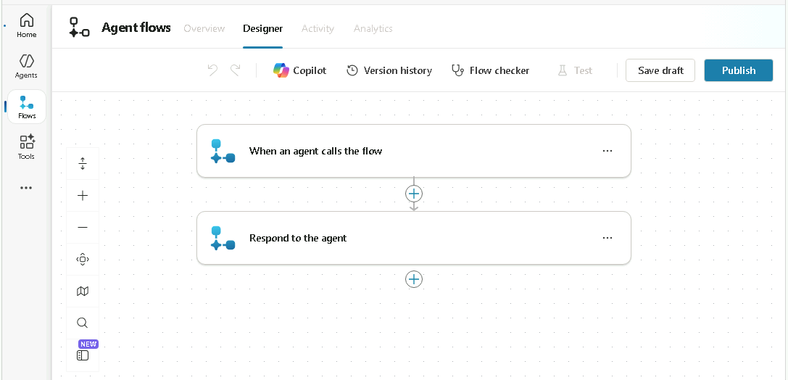

1. **[エージェントがフローを呼び出したとき]** のトリガーステップを選択し、**[+ 入力の追加]** を選択します。

1. **[テキスト]** を選択します。

1. *[入力]* に「`Task Summary`」を入力し、*[入力してください]* に「`Analyzed tasks`」を入力します。

   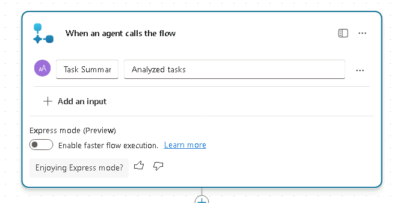

1. ページの右上付近にある **[下書きを保存]** を選択します。

1. **[概要]** タブを選択します。

1. **詳細** セクションで **編集** を選択します。

   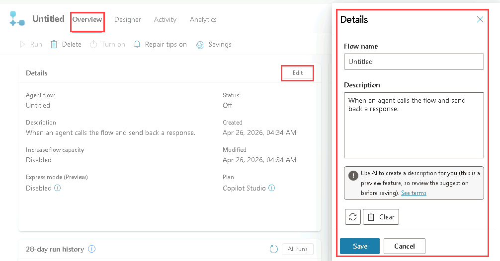

1. **[詳細]** ペインで、**[フロー名]** を `Send Summary to Teams` に更新します。

1. **[説明]** に「`Post a message to Teams with the summary of the task analysis`」と入力します

1. **[保存]** を選択します。

### タスク 2.2 - [Teams に投稿する] アクション

1. **[デザイナー]** タブを選択します。

1. ワークフロー内の 2 つのステップの間にある **[+]** アイコンを選択し、新しいアクションを挿入します。

1. **検索** フィールドに「`Teams`」と入力し、**[Microsoft Teams]** コネクタの **[さらに表示]** を選択します。

   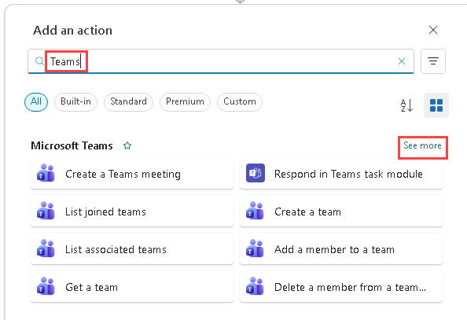

1. **チャットまたはチャネルにメッセージを投稿する**アクションを選択します。

1. **[サインイン]** を選択します。

   > [!NOTE]
   > "OAuth 接続の作成に失敗しました。ClientWarning: ブラウザーによって接続認証のポップアップ ウィンドウがブロックされました" というエラーが表示された場合は、ブラウザーのアドレス バーで **[ポップアップがブロックされました]** アイコンを選択し、[`https://copilotstudio.microsoft.com**` からのポップアップとリダイレクトを常に許可する] を選択します。

1. アカウントを選択します。

1. **[確認が必要]** ダイアログで、**[この要求を検証し、ソースを信頼しています]** チェック ボックスをオンにし、**[アクセスを許可する]** を選択します。

1. **[投稿者]** で、**[フロー ボット]** を選択します。

1. **[投稿先]** で、**[チャネル]** を選択します。

1. **[チーム]** で、リストからチーム (たとえば、**[Leadership]**) を選択します。

1. **[チャネル]** で、一覧からチャネル (たとえば、**[全般]**) を選択します。

1. [メッセージ] で、**動的コンテンツ**を使用して、**[タスクの概要]** を選択します。**

   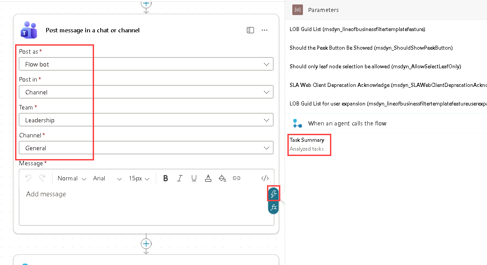

### タスク 2.3 - 応答アクション

1. 作成キャンバスで **[エージェントに応答する]** ノードを選択し、**[+ 出力の追加]** を選択します。

1. **[テキスト]** を選択します。

1. "名前を入力してください" に、「`Message`」と入力します。**

1. "応答する値を入力してください" で、**動的コンテンツ**を使用して、Teams アクションからの **[メッセージ リンク]** を選択します。**

   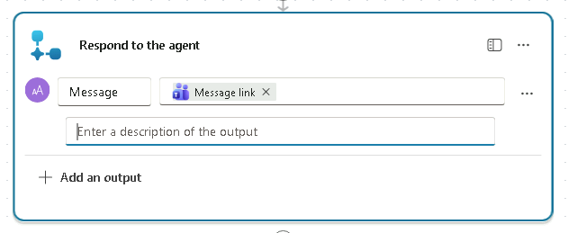

1. ページの右上付近にある **[下書きを保存]** を選択します。

1. ページの右上付近にある **[発行]** を選択します。

1. Copilot Studio の左側のナビゲーションで、**[ツール]** を選択してワークフローの状態が **[準備完了]** であることを確認します。

### タスク 2.4 - ワークフローをツールとしてエージェントに追加する

1. 左側のナビゲーション ウィンドウから **[エージェント]** を選択します。

1. **[タスクの分析]** エージェントを開きます。

1. **[ツール]** タブを選択します。

1. **[+ ツールの追加]** を選択します。

1. **[ツールの追加]** ダイアログで、**[ワークフロー]** フィルターを選択します。

   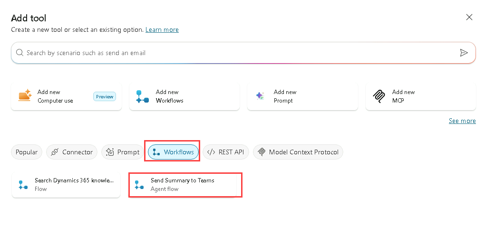

1. **[Teams への要約の送信]** ワークフローを選択します。

1. **[追加と構成]** を選択します。

1. **[詳細]** セクションの **[説明]** に、「`Sends a summary of the completed task analysis to a Microsoft Teams channel`」と入力します。

1. **[追加の詳細]** を展開し、以下を選択または入力します。

   - **このツールを使用できる場合**: エージェントはこのツールをいつでも使用できる
   - **実行前にエンドユーザーに確認する**: いいえ
   - **使用する資格情報**: エンドユーザーの資格情報
   - **説明**: `Please sign in to notify Teams`

1. **[入力]** セクションの *[次を使用して入力する]* で、**[AI で動的に入力する]** を選択します。
  これにより、エージェントは会話コンテキストから適切な入力値を動的に決定できます。

1. **[完了]** セクションの **[実行後]** で、**[生成 AI で応答を記述する]** を選択します。

   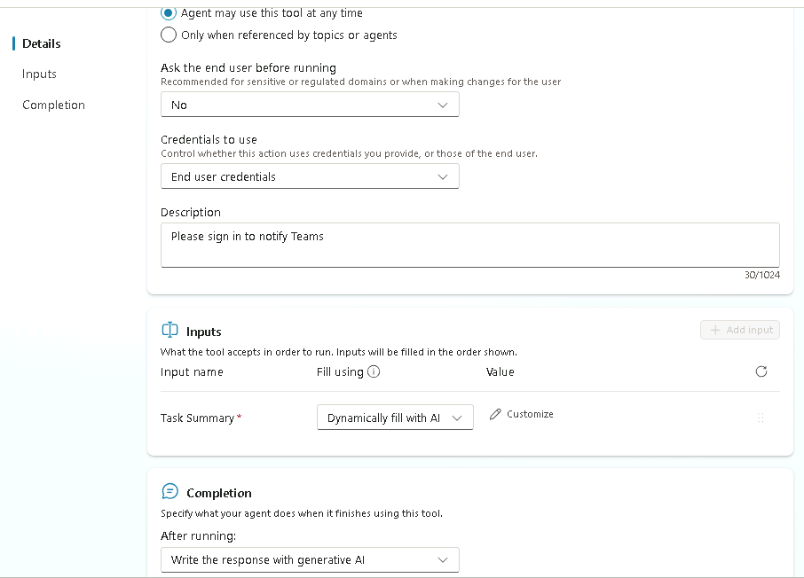

1. **[保存]** を選択します。

### タスク 2.5 - エージェントへの指示を更新する

1. **[概要]** タブを選択します。

1. **[指示]** セクションで、**[編集]** を選択します。

1. エージェントへの指示の "## ステップバイステップの指示" で、最後のステップに `Use the ` を追加し、`/` を入力し、**[Teams に要約を送信する]** ツールを選択して、「` when the task analysis is complete.`」と入力します。**

   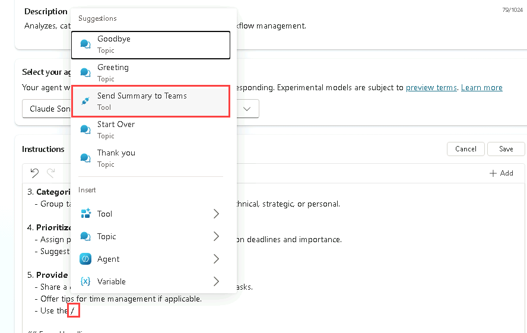

1. **[保存]** を選択します。

### タスク 2.6 - エージェントのワークフロー ツールをテストする

1. ページの右上にある **[テスト]** アイコンを選択して、テスト パネルを開きます。

1. **[テスト]** ペインで、変数 **{x}** アイコンの横にある省略記号 (**[...]**) を選択し、**[テスト時にアクティビティ マップを表示する]** を **[オン]** に切り替え、**[トピック間の追跡]** を **[オフ]** に切り替えます。

   ![[アクティビティ マップを表示する]。](../media/show-activity-map.png)

1. **[テスト]** ペインの上部にある **[新しいテスト セッションの開始]** アイコン (**[+]**) を選択します。

1. **会話の開始**メッセージが表示されたら、エージェントによって会話が開始されます。 これに対して、作成したトピックをトリガーしてみましょう。

   `Analyze this list of tasks 1. Build an agent, 2. Test an agent, 3. Deploy an agent`

1. Microsoft Teams への接続を求められたら、**[許可]** を選択します。

   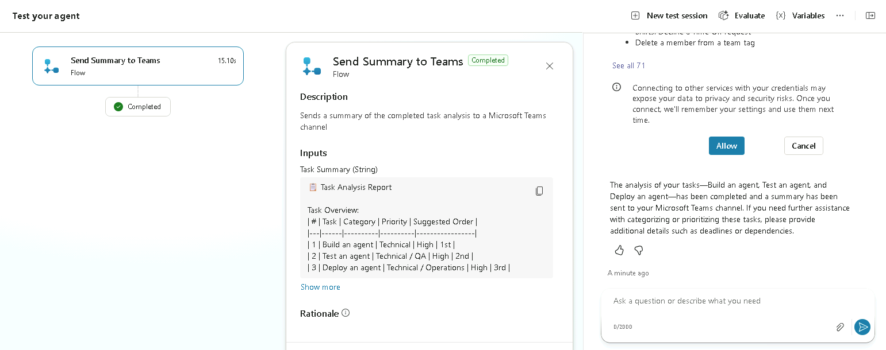

1. 新しいブラウザー タブで、`https://teams.cloud.microsoft/` に移動し、メッセージが表示されたらサインインします。

1. ワークフローでさきほど選択したチームとチャネルに移動し、タスク分析の概要が Teams チャネルに投稿されたことを確認してください。

   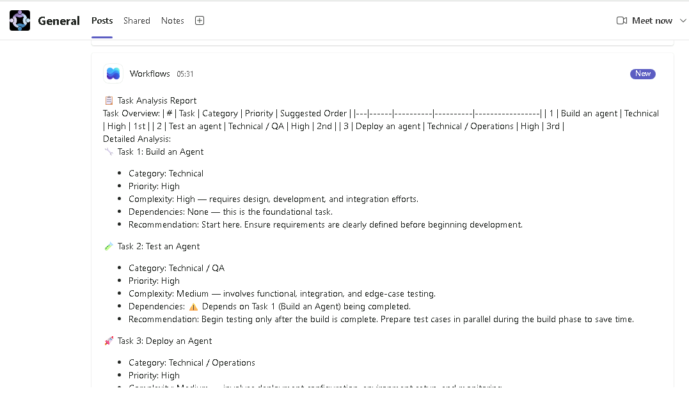

## 演習 3 - トピック内に、Excel ファイルを分析するワークフロー ツールを作成する

この演習では、Copilot を使用して説明からトピックを作成し、Excel ファイル内のタスクを分析するワークフロー ツールを作成し、トピックからツールを呼び出します。

### タスク 3.1 - Excel ファイルを作成する

1. Copilot Studio で、左上隅にある **[アプリ起動ツール]** アイコンを選択し、**[OneDrive]** を選択します。

   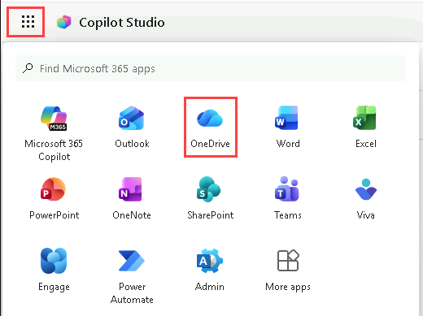

1. ウェルカム メッセージが表示されたら、すべてスキップします。

1. **[+ 作成またはアップロード]** を選択します。

1. **[Excel ブック]** を選択します。

   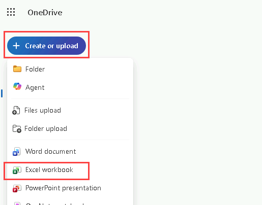

1. **[Excel ブック]** の左上で、**[ブック]** を選択し、「`Operations tasks`」と入力して、ファイルの名前を変更します。

   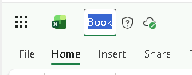

1. 最初の行に次の列を作成します。

   - `Reference`
   - `Title`
   - `Description`
   - `Requested by`
   - `Priority`
   - `Status`

1. 2 行目に最初のタスクを入力します。

   - `OPS-001`
   - `Server Patch Update`
   - `Apply monthly security patches to production servers`
   - `IT Operations`
   - `High`
   - `Open`

1. 3 行目に 2 番目のタスクを入力してください:

   - `OPS-002`
   - `Backup Validation`
   - `Verify nightly backups completed successfully`
   - `Infrastructure Team`
   - `Medium`
   - `In Progress`

1. 4 行目に 3 番目のタスクを入力します。

   - `OPS-003`
   - `Access Review`
   - `Review and remove inactive user accounts`
   - `Security Team`
   - `High`
   - `Open`

1. 5 行目に 4 番目のタスクを入力します。

   - `OPS-004`
   - `Incident Report`
   - `Document root cause for recent service outage`
   - `Service Desk`
   - `Medium`
   - `Completed`

   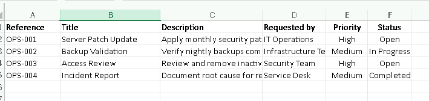

1. データを含む行と列 (A1:F5) を選択し、ツールバーで、**[挿入]** タブ、**[テーブル]**、**[OK]** を選択します。

1. **[テーブルの設計]** タブを選択し、左上で、テーブルの名前を *Table1* から **`Tasks`** に変更します。

   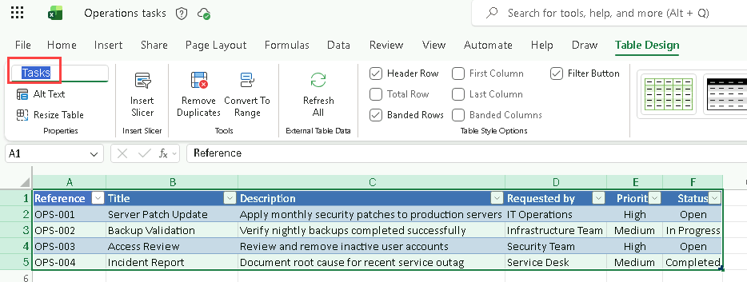

1. Excel ブックが含まれているブラウザー タブを閉じます。

1. OneDrive で **[マイ ファイル]** を選択し、オペレーション タスクの Excel ブックが一覧に表示されることを確認します。

1. OneDrive のブラウザー タブを閉じます。

### タスク 3.2 – Excel タスクの分析ワークフローを作成する

1. Copilot Studio の左側のナビゲーションで、**[ツール]** を選択します。

1. **[+ ツールの追加]** を選択します。

1. **[ツールの追加]** ダイアログで、**[エージェント フロー]** タイルを選択します。

1. **[エージェントがフローを呼び出したとき]** トリガーと **[エージェントに応答する]** アクションがワークフローに追加されていることを確認します。

1. **[エージェントがフローを呼び出したとき]** のトリガーステップを選択し、**[+ 入力の追加]** を選択します。

1. **[テキスト]** を選択します。

1. *[入力]* に「`Priority`」を入力し、*[入力してください]* に「`Priority of Tasks`」を入力します。

1. ページの右上付近にある **[下書きを保存]** を選択します。

1. **[概要]** タブを選択します。

1. **詳細** セクションで **編集** を選択します。

1. **[詳細]** ペインで、**[フロー名]** を `Get Task List` に更新します。

1. **[説明]** で、「`Retrieve a list of tasks with a matching priority`」と入力します。

1. **[保存]** を選択します。

1. **[デザイナー]** タブを選択します。

1. ワークフロー内の 2 つのステップの間にある **[+]** アイコンを選択し、新しいアクションを挿入します。

1. **検索** フィールドに「`Excel`」と入力し、**[Excel Online (Business)]** コネクタの **[さらに表示]** を選択します。

1. **表内に存在する行を一覧表示する**アクションを選択します。

1. **[サインイン]** を選択して、接続を作成します。

1. **[アカウントにサインイン]** ダイアログで、このラボ環境に使用しているアカウント (例: **MOD Administrator**) を選択し、**[この要求を検証し、ソースを信頼しています]** チェックボックスをオンにし、**[アクセスを許可する]** を選択してください。

1. **[場所]** で **[OneDrive for Business]** を選択します。

1. **[ドキュメント ライブラリ]** で、**[OneDrive]** を選択します。

1. **[ファイル]** で、**[オペレーション タスク]** ブックを参照して選択します。

1. **[テーブル]** で、**[タスク]** を選択します。

   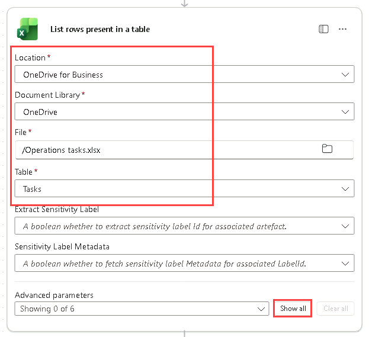

1. **[すべて表示]** を選びます。

1. **[フィルター クエリ]** で、「`Priority eq ''`」と入力します。

1. 2 つの単一引用符の間にカーソルを移動させ、**動的コンテンツ**を使用して **Priority** 入力パラメーターを挿入します。

   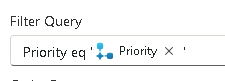

1. 作成キャンバスで **[エージェントに応答する]** ノードを選択し、**[+ 出力の追加]** を選択します。

1. **[テキスト]** を選択します。

1. "名前を入力してください" に、「`Task list`」と入力します。**

1. "応答する値を入力してください" で、**動的コンテンツ**を使用して、**[テーブル内にある行を一覧表示する]** アクションから **[本文/値]** を選択します。**

1. ページの右上付近にある **[下書きを保存]** を選択します。

1. ページの右上付近にある **[発行]** を選択します。

1. 左側のナビゲーションで、**[ツール]** を選択してワークフローの状態が **[準備完了]** であることを確認します。

### タスク 3.3 – トピックをエージェントに追加する

1. 左側のナビゲーション ウィンドウから **[エージェント]** を選択します。

1. **[タスクの分析]** エージェントを開きます。

1. **[Topics]** タブを選択します。

1. **[+ トピックの追加]** を選択し、**[Copilot を使用して説明から追加]** を選択します。 新しいダイアログ ウィンドウが表示されます。

1. **[Name your topic]** テキスト ボックスに「**`Priority Tasks`**」と入力します。

1. **[トピックを作成する目的]** テキスト ボックスに「`Ask the user to choose a priority from a list containing High, Medium, and Low`」と入力します。

1. **［作成］** を選択します

   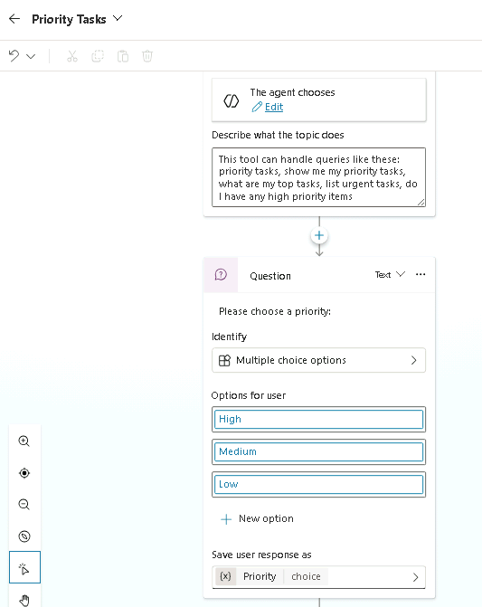

1. 質問ノードの下部にある **Priority** 変数を選択して **[変数のプロパティ]** を開きます。

1. **[使用]** で、**[グローバル (どのトピックでもアクセス可能)]** を選択します。

   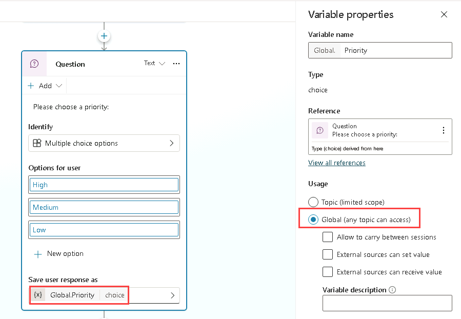

1. **[保存]** を選択します。

### タスク 3.4 - ワークフローをツールとして追加する

1. 左側のナビゲーション ウィンドウから **[エージェント]** を選択します。

1. **[タスクの分析]** エージェントを開きます。

1. **[ツール]** タブを選択します。

1. **[+ ツールの追加]** を選択します。

1. **[ツールの追加]** ダイアログで、**[ワークフロー]** フィルターを選択します。

1. **[タスク一覧の取得]** ワークフローを選択します。

1. **[追加と構成]** を選択します。

1. **[詳細]** セクションの **[説明]** に、「`Retrieves a list of tasks for a specified priority`」と入力します。

1. **[追加の詳細]** を展開し、以下を選択または入力します。

   - **このツールを使用できる場合**: トピックやエージェントによって参照される場合のみ
   - **実行前にエンドユーザーに確認する**: いいえ
   - **使用する資格情報**: エンドユーザーの資格情報
   - **説明**: *`Please sign in to retrieve tasks`*

1. **[入力]** セクションの **[次を使用して入力する]** で、**[カスタム値]** を選択し、**Priority** グローバル変数を選択します。

   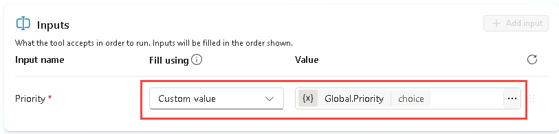

1. **[完了]** セクションの **[実行後]** で、**[生成 AI で応答を記述する]** を選択します。

1. **[保存]** を選択します。

### タスク 3.5 - ワークフロー ツールをトピックに追加する

1. **[Topics]** タブを選択します。

1. **[優先タスク]** トピックを選択します。

1. **[質問]** ノードの下で、**+** アイコンを選択し、**[ツールの追加]**、**[ツール]** タブ、**[タスク一覧の取得]** ツールの順に選択します。

   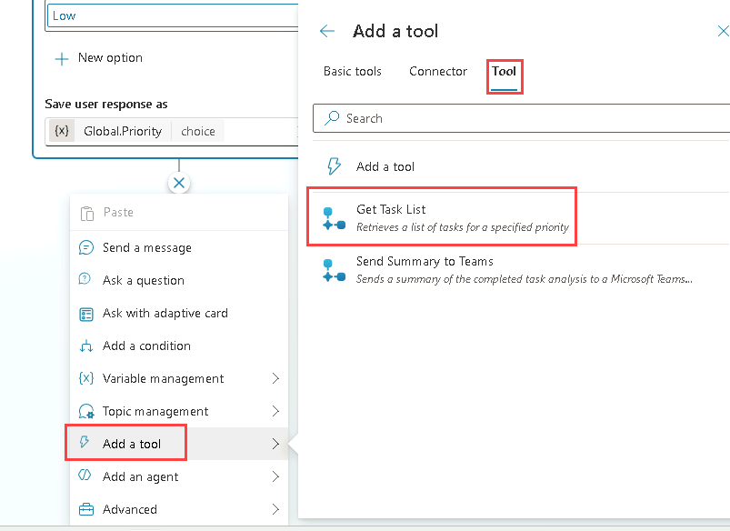

1. **[保存]** を選択します。

### タスク 3.6 - トピックを使用してエージェントへの指示を更新する

1. **[概要]** タブを選択します。

1. **[指示]** セクションで、**[編集]** を選択します。

1. エージェントへの指示の "## Skills" で、最後のステップに `Use the ` を追加し、`/` を入力し、**[優先タスク]** トピックを選択して、「` to get the task list.`」と入力します。**

1. **[保存]** を選択します。

### タスク 3.7 - ワークフロー ツールをテストする

1. ページの右上にある **[テスト]** アイコンを選択して、テスト パネルを開きます。

1. **[テスト]** ペインで、変数 **{x}** アイコンの横にある省略記号 (**[...]**) を選択し、**[テスト時にアクティビティ マップを表示する]** を **[オフ]** に切り替え、**[トピック間の追跡]** を **[オン]** に切り替えます。

1. **[テスト]** ペインの上部にある **[新しいテスト セッションの開始]** アイコン (**[+]**) を選択します。

1. **会話の開始**メッセージが表示されたら、エージェントによって会話が開始されます。 これに対して、作成したトピックをトリガーしてみましょう。

   `Analyze the task list`

1. **[優先タスク]** トピックが表示されます。

1. **[中]** を選択します。

1. **Excel Online (Business)** に接続するように求められたら、**[許可]** を選択します。

1. **[テスト]** パネルには、2 つのタスクが含まれています。

   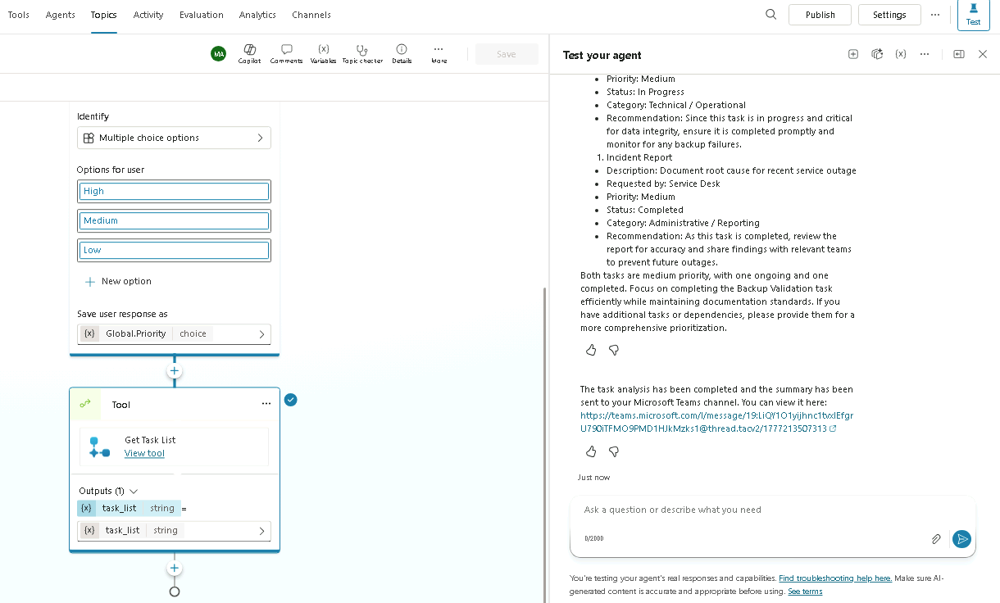

1. 新しいブラウザー タブで、`https://teams.cloud.microsoft/` に移動し、メッセージが表示されたらサインインします。

1. 先ほど選択したチームとチャンネルに移動し、そのチャンネルに投稿された 2 つのタスクを確認します。

   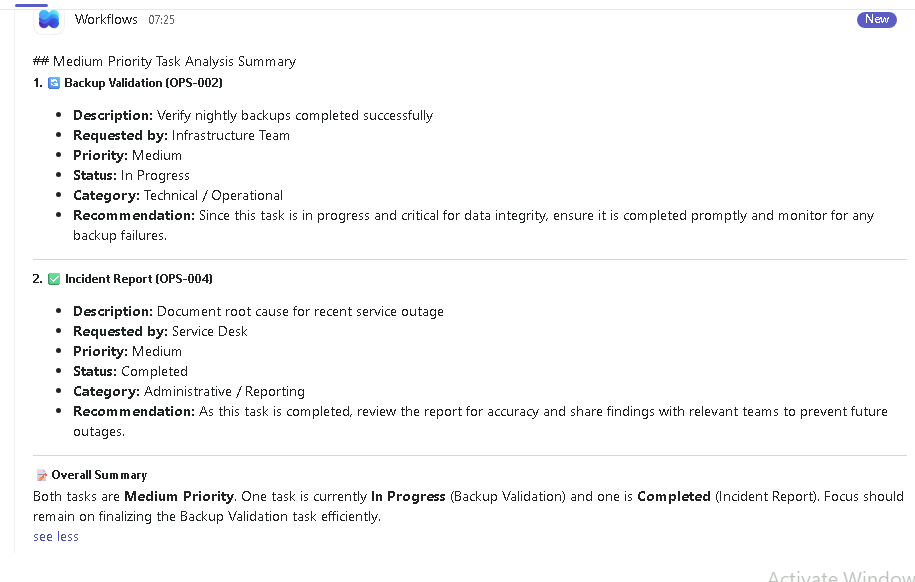

## まとめ

このラボでは、エージェントによって呼び出されるワークフロー ツールを、生成 AI を使用して作成し、トピックからも作成しました。
