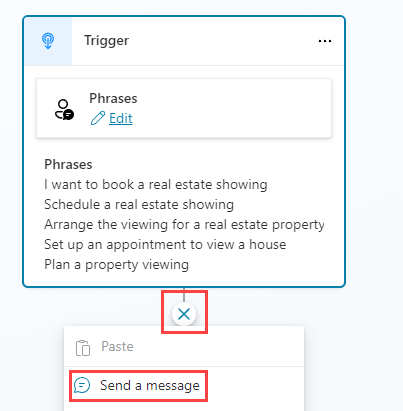
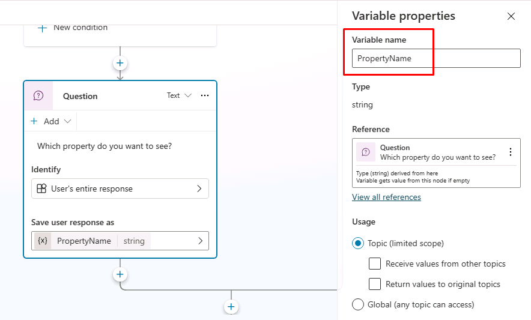
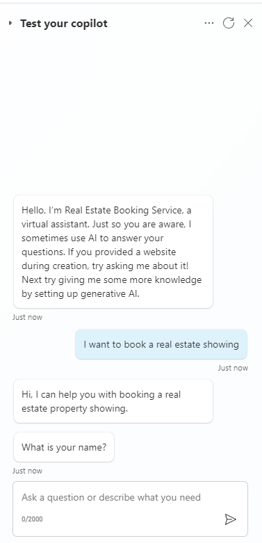
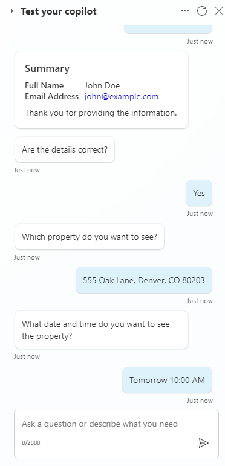

---
lab:
  title: ノードを管理する
  module: Manage topics in Microsoft Copilot Studio
---

# ノードを管理する

## シナリオ

この演習では、生成 AI を有効にしたまま、ノードを使用して予測可能なステップごとの会話フローを構築します。 生成 AI を有効にすると、エージェントが一部のプロンプトに動的に応答する場合があります。 トピックとノードは、構造化された反復可能な結果が必要な場合に使用されます。たとえば、必要な情報を決まった順序で収集する場合です。

この演習では、次のことを行います。

- **[内覧予約]** のトピックを作成する
- ノードを追加して構造化された会話フローを適用する
- エージェントをテストし、トピックのルーティングを確認する

この演習の所要時間は約 **30** 分です。

## 学習する内容

- 生成型 AI が有効な場合に、ノードを使用して構造化された会話を適用する方法
- 変数のスコープを使用してトピック間で変数を共有する方法
- メッセージ、質問、条件、およびトピック管理のノードを使用して、反復可能なステップごとのトピック フローを構築する方法

## ラボ手順の概要

- 内覧予約のトピックを作成する
- [内覧予約] のトピックで [顧客の詳細] のトピックの変数を使用するように変数のスコープを構成する
- ノードの作成と編集
- エージェントをテストする
  
## 前提条件

- **ラボ: トピックの管理**を完了している必要があります

## 詳細な手順

## 演習 1 - 空白からトピックを作成する

この演習では、**[内覧予約]** のトピックを作成し、トリガー フレーズを追加します。 トリガー フレーズは、ユーザーが内覧を予約しようとしていることをエージェントが認識するのに役立ちます。

### タスク 1.1 - 空白からトピックを作成する

1. Copilot Studio ポータル `https://copilotstudio.microsoft.com` に移動し、適切な環境にあることを確認します。

1. 左側のナビゲーション ウィンドウから **[エージェント]** を選択します。

1. 前のラボで作成した **[Real Estate Booking Service]** エージェントを選択します。

1. **[Topics]** タブを選択します。

1. **[+ Add a topic]** を選択し、**[From blank]** を選択します。

1. **[詳細]** アイコンを選択して [トピックの詳細] ダイアログ (**[その他]** \> **[詳細]** を選択する必要がある場合があります) を開きます。

    

1. **"Name"** フィールドに、次のテキストを入力します。

    `Book Showing`

1. **"Description"** フィールドに、次のテキストを入力します。

    `Use this topic when a user wants to book, schedule, or arrange a real estate property showing`

1. **[保存]** を選択します。

### タスク 1.2 - トリガーの種類を確認する

1. トピックの上部にある **[トリガー]** ノードを選択します。 トリガーの種類が **[エージェントで選択]** に設定されていることを確認します。 

> **注** 生成オーケストレーションが有効になっていると、エージェントがこの説明を使用してトピックを開始するタイミングを決定します。

## 演習 2 - 変数のスコープ

他のトピックから変数にアクセスできるようにします。

### タスク 2.1 - 変数のスコープを構成する

1. **[Topics]** タブを選択します。

1. **[Customer Details]** トピックを選択します。

1. 上部のバーで **[変数]** を選択して [変数] ペイン (**[その他]** \> **[変数]** を選択する必要がある場合があります) を開きます。

1. **[トピック]** 変数を選択して展開します。

1. 3 つのトピック変数の右側のチェック ボックスをオンにします。 これにより、このトピックの変数を他のトピックで使用できるようになります。

    

1. **[保存]** を選択します。

## 演習 3 - ノードを使用して構造化されたトピック フローを作成する

この演習では、反復可能なステップごとのフローを適用するために、ノードを [内覧予約] トピックに追加します。

### タスク 3.1 - メッセージ ノードを追加する

1. **[Topics]** タブを選択します。

1. **[Book Showing]** トピックを選択します。

1. トリガー ノードの下にある **[+]** アイコンを選択し、**[Send a message]** を選択します。

    

1. **"Enter a message"** フィールドに、次のテキストを入力します。

    `Hi, I can help you with booking a real estate property showing.`

1. **[保存]** を選択します。

### タスク 3.2 - [顧客の詳細] トピックにルーティングする

1. **[メッセージ]** ノードの下にある** +** アイコンを選択します

1. **[トピック管理]** \> **[別のトピックに移動]** \> **[顧客の詳細]** を選択します。

    

1. **[保存]** を選択します。

### タスク 3.3 - 条件ノードを追加する

1. **[トピック]** ノードの下にある **+** アイコンを選択し、**[条件の追加]** を選択します。

1. **[Condition]** ノードで、**[DetailsCorrect]** 変数を選択します。

1. **[is equal to]** を選択します。

1. **[はい]** を選択します。

    

1. **[保存]** を選択します。

### タスク 3.4 - 質問ノードを追加する

1. 左側の **[Condition]** ノードの下にある **[+]** アイコンを選択し、**[Ask a question]** を選択します。

1. **"Enter a message"** フィールドに、次のテキストを入力します。

    `Which property do you want to see?`

1. **[Identify]** には、**[User's entire response]** を選択します。

1. **[Save user response as]** で変数を選択し **[Variable name]** に「**`PropertyName`**」と入力します。

    

1. **[保存]** を選択します。

1. 新しい **Question** ノードの **[+]** アイコンを選択し、**[Ask a question]** を選択します。

1. **"Enter a message"** フィールドに、次のテキストを入力します。

    `What date and time do you want to see the property?`

1. **[Identify]** で **[Date and time]** を選択します。

1. **[Save user response as]** で変数を選択し **[Variable name]** に「**`VisitDateTime`**」と入力します

1. 左の **[質問]** ノードの下にある **+** アイコンを選択し、**[メッセージの送信]** を選択します。

1. **"Enter a message"** フィールドに、次のテキストを入力します。

    `Great! Let me get that scheduled for you.`

1. そのメッセージ ノードの後に、ノードを追加し、**[トピック管理]** \> **[すべてのトピックを終了する]** を選択してトピックを終了します。

1. **[保存]** を選択します。

## 演習 4 - エージェントをテストする

この演習では、トピックのルーティングをテストし、会話が予想されるステップごとのフローに従うことを確認します。

### タスク 4.1 - [内覧予約] のトピックをテストする

1. ページの右上にある**テスト** アイコンを選択して、テスト パネルを開きます。

1. 画面の右上にあるテスト パネルの上部にある**省略記号 [...]** を選択します。

1. 有効になっていない場合は、 **[Track between topics]** を有効にします。

    

1. テスト パネルの上部にある **[新しいテスト セッションの開始]** アイコンを選択します。

1. **会話の開始**メッセージが表示されたら、エージェントによって会話が開始されます。 これに対して、作成したトピックをトリガーしてみましょう。

    `I want to book a real estate showing`

1. エージェントは、"What is your name?" (あなたの名前は何ですか?) と応答するはずです。 。

    

1. 名前を指定します。

1. メール アドレスを入力します。

1. 情報を入力すると、入力した情報がアダプティブ カードに表示され、詳細が正しいかどうかを確認します。 **[はい]** を選択します。

**[内覧予約]** のトピックに戻ったことがわかります。

1. **Which property to you want to see?** プロンプトに `555 Oak Lane, Denver, CO 80203` を入力します。

1. **What date and time do you want to see the property?** プロンプトに `Tomorrow 10:00 AM` を入力します。

    

## まとめ
このラボでは、生成 AI を有効にしたまま、[内覧予約] のトピックを作成し、ノードを使用して構造化されたステップごとの対話を適用しました。 また、[顧客の詳細] で収集された情報をトピック間で使用できるように、変数のスコープも構成しました。
