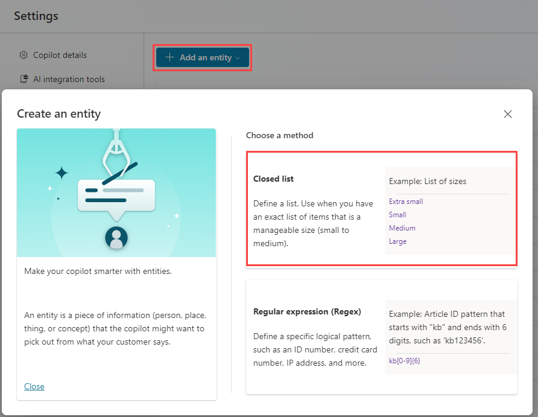
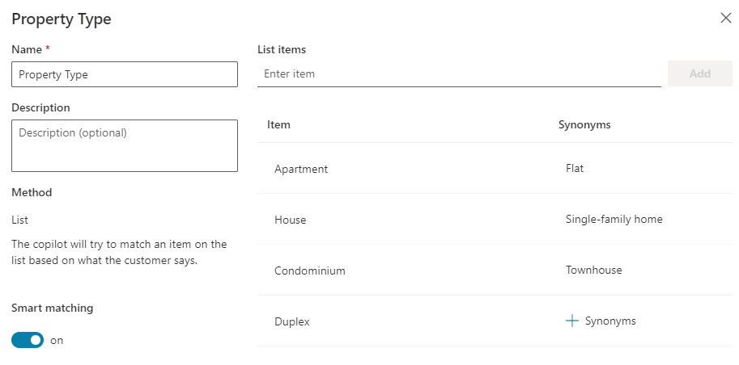
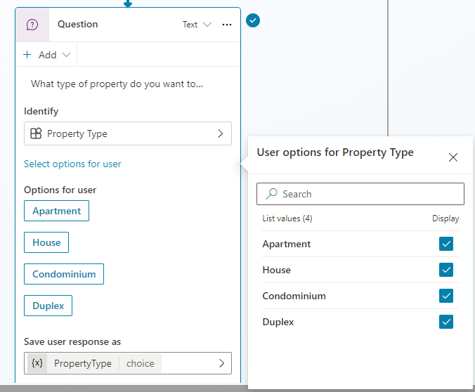

---
lab:
  title: エンティティの使用
  module: Work with entities and variables in Microsoft Copilot Studio
---

# エンティティの使用

## シナリオ

この演習では、次のことを行います。

- エンティティの作成と使用

この演習の所要時間は約 **15** 分です。

## 学習する内容

- 生成 AI でエンティティを使用する方法
- エンティティが自由形式の入力を構造化された変数に変換する方法

## ラボ手順の概要

- エンティティを作成する
- ノードでエンティティを使用する
  
## 前提条件

- **ラボ: ノードの管理**を完了している必要があります

## 詳細な手順

## 演習 1 - 物件タイプ エンティティを作成する

Microsoft Copilot Studio では、エンティティを使用してユーザーの意図を理解します。 よく使用される情報用に、事前構築済みのエンティティが多数含まれています。 特定の目的に合わせて、カスタム エンティティを作成できます。

### タスク 1.1 - 事前構築済みのエンティティを表示する

1. Microsoft Copilot Studio ポータル `https://copilotstudio.microsoft.com` に移動し、適切な環境にあることを確認します。

1. 左側のナビゲーション ウィンドウから **[エージェント]** を選択します。

1. **Real Estate Booking Service** エージェントを開きます。

1. 画面の右上にある **[Settings]** を選択します。

1. **[エンティティ]** タブを選択します。エージェントの事前構築済みエンティティの一覧が表示されます。

    ![[Entities] タブのスクリーンショット。](../media/system-entities.png)

### タスク 1.2 - 物件タイプ エンティティを作成する

1. **[+ Add an entity]** を選択し、**[+ New entity]** を選択します。

    

1. **[クローズド リスト]** を選択します。

1. **[Name]** フィールドに「**`Property Type`**」と入力します。

1. 次の項目をリストに追加します。 
    - アパート
    - マンション
    - Duplex
    - 自社

1. **Apartment** の **[+ Synonyms]** を選択し、「**`Flat`**」と入力して **[+]** アイコンを選択し、**[Done]** を選択します。

1. **Condominium** の **[+ Synonyms]** を選択し、「**`Townhouse`**」と入力して **[+]** アイコンを選択し、**[Done]** を選択します。

1. **House** の **[+ Synonyms]** を選択し、「**`Single-family home`**」と入力して **[+]** アイコンを選択し、**[Done]** を選択します。

1. **[スマート マッチング]** を有効にします。

    

1. **[保存]** を選択します。

1. エンティティが保存されたら、[プロパティの種類] ウィンドウを閉じます。

### タスク 1.3 - ベッドルーム エンティティの数を作成する

1. **[+ Add an entity]** を選択し、**[+ New entity]** を選択します。

1. **[Regular expression (Regex)]** タイルを選択します。

1. **[Name]** フィールドに「**`Number of Bedrooms`**」と入力します。

1. **[Pattern]** フィールドに「**`[1-5]`**」と入力します。

1. **[保存]** を選択します。

1. エンティティが保存されたら、[Number of Bedrooms] ペインを閉じます。

1. 右上にある **[X]** アイコンを選択して [Settings] を閉じ、エージェントに戻ります。

## 演習 2 - エンティティを使用してエージェントを改善する

会話フローでエンティティを使用して、エージェントを改善します。

### タスク 2.1 - エンティティを使用する

1. **[Topics]** タブを選択します。

1. **[Book Showing]** トピックを選択します。

1. **[Condition]** ノードとプロパティ **[Question]** ノードの間の **[+]** アイコンを選択し、**[Ask a question]** を選択します。

1. **"Enter a message"** フィールドに、次のテキストを入力します。

    `What type of property do you want to see?`

1. **[Identify]** には、**[Property Type]** を選択します。

1. **[Select options for user]** を選択し、4 つの値すべてに対して **[Display]** オプションをオンにします。

1. **[Save user response as]** で変数を選択し、**[Variable name]** に「**`PropertyType`**」を入力します。

    

1. 新しい **[Question]** ノードの下にある **[+]** アイコンを選択し、**[Ask a question]** を選択します。

1. **"Enter a message"** フィールドに、次のテキストを入力します。

    `How many bedrooms do you need?`

1. **[Identify]** には、**[Number of Bedrooms]** を選択します。

1. **[Save user response as]** で変数を選択し、**[Variable name]** に「**`NumberofBedrooms`**」を入力します。

1. **[保存]** を選択します。

### タスク 2.2 - エンティティ抽出をテストする

1. **[テスト]** パネルを開きます。

1. **[Track between topics]** を有効にします。

1. 新しいテスト セッションを開始します。

1. 会話開始メッセージが表示されたら、`I want to book a real estate showing` と入力して送信します。

1. **[内覧予約]** トピックのあいさつメッセージでエージェントが応答することを確認します。

1. プロンプトが表示されたら、名前とメール アドレスを入力し、情報を確認します。

1. 表示する物件のタイプを確認するメッセージが表示されたら、`I'm looking for a house` と入力します。

    > この応答は、自然言語を意図的に使用しています。 **物件タイプ** エンティティは**一戸建て**をキャプチャするはずです。

1. どの物件を表示するかを確認するメッセージが表示されたら、`555 Oak Lane, Denver, CO 80203` と入力します。

1. 物件を表示する日時を確認するメッセージが表示されたら、`Tomorrow 8:00 AM` と入力します。

エージェントが、予約要求がスケジュールされていることを示すメッセージで応答することを確認します。

## まとめ

このラボでは、生成 AI を有効にしたまま、エンティティを使用して自然言語から構造化された値を抽出しました。 エンティティを使用すると、エージェントが予測可能な動作を維持しながら柔軟な入力を受け入れることができます。

次のラボでは、ツールを使用してこれらの構造化された値に作用し、データの取得や作成といった実際の操作を実行します。
