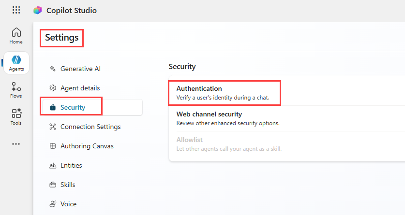

---
lab:
  title: Microsoft Copilot Studio で生成 AI を使用する
  module: Enhance Microsoft Copilot Studio agents
---

# Microsoft Copilot Studio で生成 AI を使用する

## シナリオ

このラボでは、生成 AI を有効にしたまま、典拠、フォールバック動作、安全性の制御を構成することで、エージェントを運用環境で使用できるように準備します。

この演習では、次のことを行います。

- 承認されたナレッジ ソース内でのみ生成 AI を使用するようにエージェントを構成する
- 質問に回答できない場合に、予測されたとおり、かつ安全に応答するようにエージェントをガイドする

この演習の所要時間は約 **20** 分です。

## 学習する内容

- 典拠を使用して生成 AI を制約する方法
- 安全なフォールバック動作のためのシステム トピックを構成する方法
  
## 前提条件

- 以下を完了している必要があります:「**ラボ: エージェント フローを作成する**」

## 詳細な手順

## 演習 1 - 認証を構成する

### タスク - 認証を構成する

1. まだ開いていない場合は、Microsoft Copilot Studio ポータル `https://copilotstudio.microsoft.com` に移動し、適切な環境にあることを確認します。

1. **Real Estate Booking Service** エージェントを開きます。

1. **Real Estate Booking Service** の右上にある **[Settings]** を選択します。

1. **[セキュリティ]** タブをクリックします。

1. **認証**を選択します。

    

1. **[Authenticate with Microsoft]** を選択します。

1. **[保存]** を選択します。

1. 確認ウィンドウで **[Save]** を選択します。

1. 右上隅にある **X** を選択して、**[Settings]** を閉じます。

1. **公開**を選択します。

## 演習 2 - 承認されたデータを生成応答の典拠とする

この演習では、エージェントが承認された知識のみを使用して応答できるように、生成応答を構成します。

### タスク 2.1 - 会話強化で生成応答を制限する

1. **[トピック]** を選択します

1. **[システム]** トピックでフィルター処理します。

1. **[会話強化]** トピックを開きます。

1. **[生成応答の作成]** ノードを選択します。

1. **[データ ソース]** で **[編集]** を選択します。

1. **[Search only selected sources]** を選択します。

1. **[ナレッジの追加]** を選択します。

1. **[不動産物件]** Dataverse テーブルと **[エージェントに追加]** を選択します。

1. ナレッジ ソースとして **[Web サイト]** と **[不動産物件]** テーブルの両方をチェックします。

1. 下スクロールして **[AI が独自の一般的な知識を使用できるようにする]** を無効にします。

1. **[保存]** を選択します。

エージェントが、一般的なモデルの知識を使用して、自由回答式の質問に回答できなくなります。

## 演習 3 - 既定のフォールバックを典拠に基づくフォールバックに置き換える
この演習では、システム フォールバック動作を再構成します。

### タスク 3.1 - システム フォールバック トピックで生成型回答を使用する

1. **[Topics]** タブを選択し、**[System]** フィルターを選択します。

1. **フォールバック** トピックを選択します。

    

1. **[メッセージ]** ノードで**省略記号 [...]** メニューを選択し、**[削除]** を選択します。

1. **[条件]** ノードの下にある **+** アイコンを選択し、**[詳細]** \> **[生成応答]** を選択します。

1. **[入力]** フィールドで **[システム]** タブを選択し、**[Activity.Text]** を選択します。

1. **[Data sources]** の **[Edit]** を選択します。

    

1. **[Search only selected sources]** を選択します。

1. **[Web サイト]** と **[不動産物件]** Dataverse テーブルを追加します。

1. 下スクロールして **[AI が独自の一般的な知識を使用できるようにする]** を無効にします。

1. **[コンテンツ モデレーション レベル]** の下にある **[カスタマイズ]** チェックボックスをオンにし、**[中]** を選択します。

1. **[保存]** を選択します。

エージェントが質問に回答できない場合に、推測する代わりに、典拠データを使用して安全に応答するようになります。

## タスク 3.2 - 制御されたフォールバック応答を追加する

1. [フォールバック] トピックで、**[メッセージの送信]** ノードを [生成応答] ノードの後に追加します。

1. `Sorry, I don’t have enough information to help with that request. I can assist with booking real estate showings or questions related to available properties.` のメッセージを入力します。

1. **[保存]** を選択します。

エージェントが、あいまいな応答を生成する代わりに、スコープと制限を明確に伝えるようになりました。 エージェントが確実に生成応答パスのトピックを選択できない場合にのみ、[フォールバック] トピックがトリガーされることがわかります。 [フォールバック] トピックは、不明な意図のみを対象としています。

## 演習 4 - アクションを使用して運用環境の動作を検証する
この演習では、エージェントに、知識のスコープの内と外両方にある質問をします。

### タスク 4.1 - サポートされているシナリオをトリガーする

1. **[テスト]** パネルを開きます。

1. 新しいテスト セッションを開始します。

1. 構成済みの知識でサポートされている質問をします (例: `Is there a property on Oak Lane?`)

エージェントは、承認された典拠データを使用して応答するはずです。

### タスク 3.2 - サポートされていないシナリオをトリガーする

1. 同じテスト セッションで、エージェントのスコープ外にある質問をします (例: `What's for dinner?`)

エージェントは、応答の推測を避けるはずです。

## まとめ

このラボでは、次の方法で、運用環境を準備するための生成 AI の動作をアクティブに構成しました。

- 承認されたデータに対する生成応答の典拠
- 既定のフォールバック動作の置き換え
- 安全でスコープ指定された応答の適用

### 課題 - ファイルからナレッジを追加する

課題を増やすには、エージェントに追加のナレッジ ソースとしてファイルを追加してください。 会話強化にも追加されるようにします。

ファイルをダウンロードするには、新しいウィンドウを開き、`https://download.microsoft.com/documents/customerevidence/Files/4000007499/SummitRealtyCaseStudy.docx` に移動します

