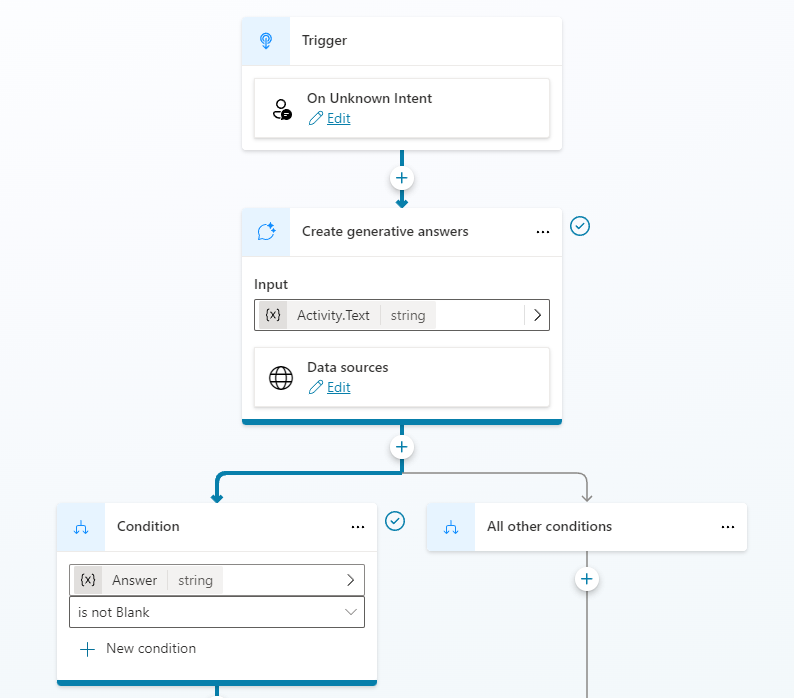
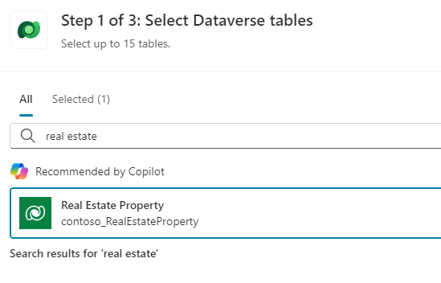
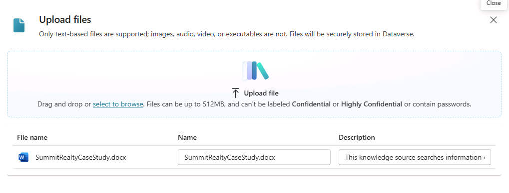
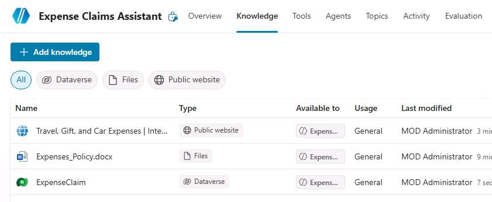
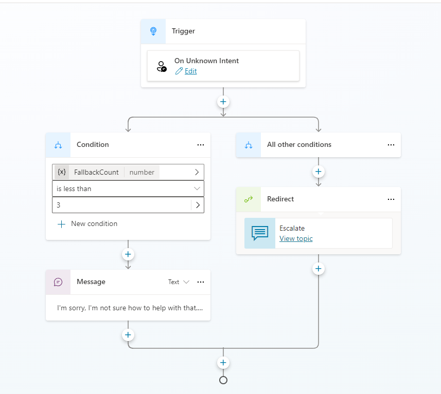
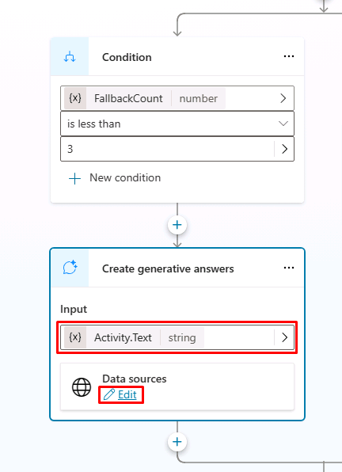

---
lab:
  title: Microsoft Copilot Studio で生成 AI を使用する
  module: Enhance Microsoft Copilot Studio agents
---

# Microsoft Copilot Studio で生成 AI を使用する

## シナリオ

この演習では、次のことを行います。

- エージェントでナレッジと生成 AI を使用する

この演習の所要時間は約 **30** 分です。

## 学習する内容

- 生成回答機能を使用してエージェントの応答を改善する方法

## ラボ手順の概要

- 生成 AI を有効にする
- ナレッジの追加
  
## 前提条件

- 以下を完了している必要があります:「**ラボ: エージェント フローを作成する**」

## 詳細な手順

## 演習 1 - 生成 AI を構成する

### タスク 1.1 - オーケストレーションを有効にする

1. まだ開いていない場合は、Microsoft Copilot Studio ポータル `https://copilotstudio.microsoft.com` に移動し、適切な環境にあることを確認します。

1. 左側のナビゲーションから **[エージェント]** を選択します。

1. 前のラボで作成した **[Real Estate Booking Service]** を選択します。

1. 画面の右上隅にある **[Settings]** ボタンを選択します。

1. **[生成 AI オーケストレーションを使用して、エージェントの応答を生成しますか?]** に、**[はい - 必要に応じて使用可能なツールとナレッジを使用して、応答を動的にします]** を選択します。

1. **[保存]** を選択します。

1. 設定ウィンドウを閉じます。

### タスク 1.2 - 会話強化トピックで生成型回答を使用する

1. **[Topics]** タブを選択し、**[System]** フィルターを選択します。

1. **[Conversational boosting]** トピックを選択します。

    

1. **[Create generative answers]** ノードを確認します。

### タスク 1.3 - 認証を構成する

1. 画面の右上にある **[Settings]** を選択します。

1. **[セキュリティ]** タブをクリックします。

1. **認証**を選択します。

1. **[Authenticate with Microsoft]** を選択します。

1. **[保存]** を選択します。

1. 確認ウィンドウで **[Save]** を選択します。

1. 右上隅にある **X** を選択して、**[Settings]** を閉じます。

## 演習 2 - ナレッジを追加する

### タスク 2.1 - Dataverse からナレッジを追加する

1. **[Knowledge]** タブを選択します。

1. **[+ Add knowledge]** を選択します。

1. **Dataverse** を選択します。

1. **Real Estate Property** テーブルを選択します。

    

1. **[エージェントへの追加]** を選択します。

### タスク 2.2 - ファイルからナレッジを追加する

1. 新しいウィンドウを開き、`https://download.microsoft.com/documents/customerevidence/Files/4000007499/SummitRealtyCaseStudy.docx` に移動して、[**Microsoft ケース スタディ**](https://download.microsoft.com/documents/customerevidence/Files/4000007499/SummitRealtyCaseStudy.docx) ファイルをダウンロードします。

1. **[+ Add knowledge]** を選択します。

1. **[ファイルのアップロード]** で、ダウンロードしたケース スタディを参照して選択します。

    

1. **[エージェントへの追加]** を選択します。

    

## 演習 3 - フォールバック トピックの構成

### タスク 3.1 - システム フォールバック トピックで生成型回答を使用する

1. **[Topics]** タブを選択し、**[System]** フィルターを選択します。

1. **フォールバック** トピックを選択します。

    

1. **[メッセージ]** ノードで**省略記号 [...]** メニューを選択し、**[削除]** を選択します。

1. **Condition** ノードの **+** アイコン、**[Advanced]** の順に選択してから、**[Generative answers]** を選択します。

1. **[入力]** フィールドで **[システム]** タブを選択し、**[Activity.Text]** を選択します。

1. **[Data sources]** の **[Edit]** を選択します。

    

1. **[Search only selected sources]** を選択します。

1. **Real Estate Property** Dataverse テーブルを選択します。

1. **[Allow the AI to use its own general knowledge]** を選択解除します。

1. **[コンテンツ モデレーション レベル]** の下にある **[カスタマイズ]** チェックボックスをオンにし、**[中]** を選択します。

1. **[保存]** を選択します。

## 演習 4 - 生成 AI のテスト

### タスク 4.1 エージェントの知識をテストする

1. 開いていない場合は、ページの右上にある **[テスト]** アイコンを選択してテスト パネルを開きます。

1. テスト パネルの上部にある **[新しいテスト セッションの開始]** アイコンを選択します。

1. エージェントを調べて、ナレッジ ソースの使用方法を確認します。
  - `Which cities have property listings?`
  - `Which CRM does Summit Realty use?`
